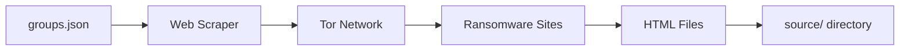
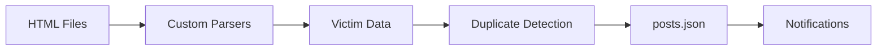
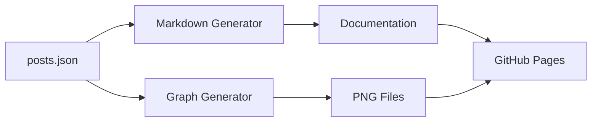

# Data Storage and Frontend Architecture

## Data Storage Strategy

### Git-Based Storage Architecture

Ransomwatch uses a unique approach to data storage by leveraging Git as both a version control system and a database. This design choice provides several benefits while introducing some limitations.

#### Core Data Files

##### 1. Groups Configuration (`groups.json`)
**Purpose**: Master configuration for all monitored ransomware groups
**Structure**:
```json
{
  "name": "lockbit3",
  "captcha": false,
  "parser": true,
  "javascript_render": false,
  "meta": "LockBit 3.0 ransomware group",
  "locations": [
    {
      "fqdn": "lockbitapt6vx4ekld5ycu47qtd3qonzjqqgl6owhbc2oc2hctuca62ad.onion",
      "title": "LockBit 3.0",
      "version": 3,
      "slug": "http://lockbitapt6vx4ekld5ycu47qtd3qonzjqqgl6owhbc2oc2hctuca62ad.onion",
      "available": true,
      "updated": "2025-06-17 12:00:00.000000",
      "lastscrape": "2025-06-17 12:00:00.000000",
      "enabled": true
    }
  ],
  "profile": [
    "https://example.com/lockbit-analysis"
  ]
}
```

**Key Features**:
- **Multi-location Support**: Each group can have multiple mirrors/relays
- **Status Tracking**: Real-time availability and last-seen timestamps
- **Configuration Flags**: Parser settings, captcha detection, JavaScript requirements
- **Metadata**: Additional context and reference links

##### 2. Posts Database (`posts.json`)
**Purpose**: Historical record of all discovered victim posts
**Structure**:
```json
{
  "post_title": "Acme Corporation",
  "group_name": "lockbit3",
  "discovered": "2025-06-17 12:00:00.000000"
}
```

**Characteristics**:
- **Append-only**: New posts are added, existing posts are never modified
- **Chronological**: Ordered by discovery timestamp
- **Deduplicated**: Duplicate detection prevents re-indexing
- **UTF-8 Support**: Handles international company names and characters

##### 3. HTML Source Archive (`source/` directory)
**Purpose**: Raw HTML content from scraped sites
**Naming Convention**: `{group_name}-{domain}.html`
**Examples**:
- `lockbit3-lockbitapt6vx4ekld5ycu47qtd3qonzjqqgl6owhbc2oc2hctuca62ad.html`
- `blackbasta-stniiomyjliimcgkvdszvgen3eaaoz55hreqqx6o77yvmpwt7gklffqd.html`

**Features**:
- **Version Control**: Full history of site changes
- **Forensic Value**: Preserved evidence of ransomware activities
- **Parser Input**: Source material for content extraction
- **Debugging**: Enables parser development and troubleshooting

### Data Processing Pipeline

#### 1. Collection Phase


#### 2. Processing Phase


#### 3. Publication Phase


### Data Analytics and Derivatives

#### Analytics-Friendly Format (`assets/groups-kv.json`)
**Purpose**: Flattened data structure for analysis tools
**Generation**: Automated via `assets/groups-kv.py`
**Structure**: Array of objects with denormalized group data

```json
[
  {
    "name": "lockbit3",
    "fqdn": "lockbitapt6vx4ekld5ycu47qtd3qonzjqqgl6owhbc2oc2hctuca62ad.onion",
    "captcha": false,
    "parser": true,
    "javascript_render": false,
    "available": true,
    "version": 3,
    "profile": ["https://example.com/analysis"],
    "meta": "LockBit 3.0 ransomware group"
  }
]
```

#### Statistical Summaries
Generated dynamically during documentation creation:
- **Group Activity**: Posts per group over time
- **Site Availability**: Online/offline status tracking
- **Discovery Trends**: New victim discovery patterns
- **Geographic Distribution**: Analysis of victim locations (when available)

## Frontend Architecture

### Static Site Generation

Ransomwatch uses a static site generator approach with Docsify for the frontend, providing a fast, secure, and cost-effective web interface.

#### Technology Stack
- **Generator**: Custom Python scripts (`markdown.py`)
- **Framework**: Docsify (Vue.js-based documentation framework)
- **Hosting**: GitHub Pages
- **CDN**: GitHub's global CDN infrastructure
- **Domain**: Custom domain (ransomwatch.telemetry.ltd)

### Site Structure

#### 1. Main Dashboard (`docs/README.md`)
**Content**:
- Real-time statistics summary
- Current monitoring scope (sites and groups)
- Recent activity metrics (24h, monthly, yearly)
- System health indicators

**Features**:
- **Auto-generated**: Updated every 2 hours
- **Responsive Design**: Mobile-friendly layout
- **Live Data**: Reflects current system state
- **Performance Metrics**: Load times and availability stats

#### 2. Complete Index (`docs/INDEX.md`)
**Content**:
- Comprehensive site listing
- Status indicators (🟢 online, 🔴 offline)
- Last-seen timestamps
- Site titles and metadata

**Format**:
```markdown
| group | title | status | last seen | location |
|-------|-------|--------|-----------|----------|
| lockbit3 | LockBit 3.0 | 🟢 | | lockbitapt6vx4... |
| blackbasta | Black Basta Blog | 🔴 | 2025-01-29 | stniiomyjliim... |
```

#### 3. Recent Activity (`docs/recentposts.md`)
**Content**:
- Last 200 discovered posts
- Chronological ordering (newest first)
- Group attribution and timestamps
- Google search integration for victim names

**Interactive Features**:
- **Clickable Victims**: Links to Google searches
- **Group Profiles**: Links to detailed group pages
- **Date Filtering**: Chronological organization
- **Search Integration**: External research capabilities

#### 4. Group Profiles (`docs/profiles.md`)
**Content**: Detailed information for each ransomware group
- **Configuration**: Parser status, captcha detection, JavaScript requirements
- **Infrastructure**: All known mirrors and relays
- **Activity History**: Complete post history for the group
- **Metadata**: Additional context and reference links

**Profile Structure**:
```markdown
## lockbit3

_parsing : `enabled`_

| title | available | version | last visit | fqdn |
|-------|-----------|---------|------------|------|
| LockBit 3.0 | true | 3 | 12:00 17/06/2025 | `lockbitapt6...` |

| post | date |
|------|------|
| `Acme Corporation` | 17/06/2025 |
| `Example Industries` | 16/06/2025 |
```

#### 5. Statistics Dashboard (`docs/stats.md`)
**Content**: Data visualizations and trend analysis
- **Trend Charts**: Posts per day over time
- **Group Activity**: Bar charts of posts by group
- **Distribution**: Pie charts of group activity percentages
- **Recent Activity**: 7-day rolling activity summaries

**Visualization Types**:
- Line charts for temporal trends
- Bar charts for group comparisons
- Pie charts for distribution analysis
- Heatmaps for activity patterns

### API Endpoints

#### JSON Data Access
The system exposes structured data through multiple endpoints:

##### 1. Groups API
**URL**: `https://ransomwhat.telemetry.ltd/groups`
**Content**: Complete groups.json data
**Format**: JSON array of group objects
**Update Frequency**: Every 2 hours
**Use Cases**: 
- Third-party integrations
- Research and analysis
- Monitoring system integration

##### 2. Posts API
**URL**: `https://ransomwhat.telemetry.ltd/posts`
**Content**: Complete posts.json data
**Format**: JSON array of post objects
**Update Frequency**: Every 2 hours
**Use Cases**:
- Threat intelligence feeds
- Historical analysis
- Alert system integration

##### 3. Analytics API
**URL**: `https://ransomwhat.telemetry.ltd/groups-kv`
**Content**: Flattened groups data
**Format**: JSON array with denormalized structure
**Use Cases**:
- Data analysis tools
- Business intelligence systems
- Research applications

### Frontend Features

#### User Experience
- **Fast Loading**: Static files served from CDN
- **Mobile Responsive**: Optimized for all device sizes
- **Search Functionality**: Built-in search across all content
- **Navigation**: Intuitive sidebar navigation
- **Accessibility**: Screen reader compatible

#### Data Visualization
- **Interactive Charts**: Hover effects and tooltips
- **Responsive Graphs**: Adapt to screen size
- **Export Capabilities**: PNG format for reports
- **Real-time Updates**: Reflect latest data automatically

#### Integration Capabilities
- **Embeddable Widgets**: Charts can be embedded in other sites
- **RSS Feeds**: Structured data feeds for automation
- **Webhook Support**: Real-time notifications
- **API Documentation**: Complete API reference

### Content Delivery Network

#### GitHub Pages Infrastructure
- **Global Distribution**: Multiple edge locations worldwide
- **HTTPS Encryption**: Automatic SSL/TLS certificates
- **Custom Domain**: Professional branding with ransomwatch.telemetry.ltd
- **Caching**: Aggressive caching for performance
- **Bandwidth**: Unlimited for public repositories

#### Performance Characteristics
- **Load Time**: <2 seconds globally
- **Availability**: 99.9% uptime (GitHub SLA)
- **Scalability**: Handles traffic spikes automatically
- **Security**: DDoS protection and security headers

### Data Access Patterns

#### Public Access
- **Web Interface**: Human-readable dashboard and reports
- **JSON APIs**: Machine-readable structured data
- **Raw Data**: Direct access to source files
- **Historical Data**: Complete version history via Git

#### Integration Examples

##### cURL Commands
```bash
# Get all groups
curl -sL ransomwhat.telemetry.ltd/groups | jq '.'

# Get recent posts
curl -sL ransomwhat.telemetry.ltd/posts | jq '.[] | select(.discovered > "2025-06-01")'

# Get specific group data
curl -sL ransomwhat.telemetry.ltd/groups | jq '.[] | select(.name == "lockbit3")'
```

##### Python Integration
```python
import requests

# Fetch latest posts
response = requests.get('https://ransomwhat.telemetry.ltd/posts')
posts = response.json()

# Filter by group
lockbit_posts = [p for p in posts if p['group_name'] == 'lockbit3']

# Get recent activity
from datetime import datetime, timedelta
recent = datetime.now() - timedelta(days=7)
recent_posts = [p for p in posts if p['discovered'] > recent.isoformat()]
```

### Security and Privacy

#### Data Protection
- **No PII**: System avoids collecting personal information
- **Sanitization**: Input validation and output encoding
- **Rate Limiting**: GitHub's built-in rate limiting
- **Access Logs**: Minimal logging for privacy

#### Content Security
- **Static Content**: No server-side execution reduces attack surface
- **HTTPS Only**: All traffic encrypted in transit
- **Content Security Policy**: Prevents XSS attacks
- **Subresource Integrity**: Ensures content integrity

The frontend architecture successfully balances functionality, performance, and security while maintaining the system's core principle of using free, managed services for maximum cost-effectiveness.