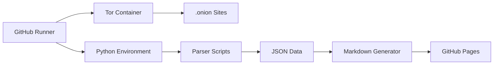

# GitHub Actions Orchestration

## Workflow Overview

Ransomwatch uses GitHub Actions as its primary orchestration platform, running entirely serverless on GitHub's infrastructure. The system consists of multiple workflows that handle different aspects of the monitoring pipeline.

## Main Workflow: `ransomwatch.yml`

### Schedule Configuration
```yaml
on:
  schedule:
    - cron: '0 */2 * * *'  # Every 2 hours
  workflow_dispatch:        # Manual trigger
```

**Schedule Analysis:**
- **Frequency**: Every 2 hours (12 executions per day)
- **Daily Runtime**: ~18 hours of potential execution time
- **Monthly Executions**: ~360 workflow runs
- **Timing**: Runs at 00:00, 02:00, 04:00, 06:00, 08:00, 10:00, 12:00, 14:00, 16:00, 18:00, 20:00, 22:00 UTC

### Workflow Architecture

#### Job Configuration
```yaml
jobs:
  torsocks-job:
    runs-on: ubuntu-latest
    timeout-minutes: 90
    services:
      torproxy:
        image: ghcr.io/joshhighet/torsocc:latest
        ports:
        - 9050:9050
```

**Key Features:**
- **Runtime Environment**: Ubuntu Latest (GitHub-hosted runner)
- **Timeout**: 90 minutes maximum execution time
- **Service Container**: Dedicated Tor proxy container
- **Network**: Isolated container networking

### Execution Pipeline

#### 1. Environment Setup
```yaml
- name: checkout the repo
  uses: actions/checkout@v2
- name: install dependencies
  run: pip3 install -r requirements.txt
```

#### 2. Data Collection Phase
```yaml
- name: run scraper
  run: python3 ransomwatch.py scrape
```
**Operations:**
- Iterates through all groups in `groups.json`
- Fetches content from each monitored location
- Uses Tor proxy for .onion sites
- Stores HTML content in `/source/` directory
- Updates availability status and timestamps

#### 3. Data Processing Phase
```yaml
- name: run parser
  env: 
    DISCORD_WEBHOOK: ${{ secrets.DISCORD_WEBHOOK }}
    DISCORD_WEBHOOK_2: ${{ secrets.DISCORD_WEBHOOK_2 }}
    MS_TEAMS_WEBHOOK: ${{ secrets.MS_TEAMS_WEBHOOK }}
    X_CONSUMER_KEY: ${{ secrets.X_CONSUMER_KEY }}
    X_CONSUMER_SECRET: ${{ secrets.X_CONSUMER_SECRET }}
    X_ACCESS_TOKEN: ${{ secrets.X_ACCESS_TOKEN }}
    X_ACCESS_TOKEN_SECRET: ${{ secrets.X_ACCESS_TOKEN_SECRET }}
  run: python3 ransomwatch.py parse
```
**Operations:**
- Executes 140+ custom parsers
- Extracts victim information from HTML
- Detects new posts and updates `posts.json`
- Sends notifications to configured services

#### 4. Documentation Generation
```yaml
- name: generate markdown & graphs for docsify
  run: python3 ransomwatch.py markdown
- name: generate kv groups for analytics
  run: python3 assets/groups-kv.py
```
**Operations:**
- Creates markdown documentation
- Generates statistical graphs
- Produces analytics-friendly data formats
- Updates GitHub Pages content

#### 5. Data Persistence
```yaml
- name: save changes
  run: |  
    git config user.name github-actions
    git config user.email 41898282+github-actions[bot]@users.noreply.github.com
    git commit --all --message "𝚌𝚛𝚘𝚗𝚋𝚘𝚝" || echo "no changes to commit"
    git push
```

#### 6. Health Monitoring
```yaml
- name: ping c2 beep bop
  run: curl -sSf "https://betteruptime.com/api/v1/heartbeat/${{ secrets.HEARTBEAT_SECRET }}" || true
```

## Build Workflow: `ransomwatch-build.yml`

### Schedule Configuration
```yaml
on:
  schedule:
    - cron: '0 0 * * 0'  # Weekly on Sunday at midnight UTC
  workflow_dispatch:
```

### Container Management
```yaml
jobs:
  push-to-github-cr:
    name: push image to github container registry
    runs-on: ubuntu-latest
    steps:
      - name: authenticate to gh container registry 
        uses: docker/login-action@v2
        with:
          registry: ghcr.io
          username: ${{ github.repository_owner }}
          password: ${{ secrets.GITHUB_TOKEN }}
      - name: build & push image
        uses: docker/build-push-action@v2
        with:
          push: true 
          tags: ghcr.io/${{ github.repository }}:latest
```

## Additional Workflows

### Code Quality: `pylint.yml`
- **Purpose**: Static code analysis
- **Trigger**: Pull requests and pushes
- **Tools**: Pylint for Python code quality

### Security: `codeql-analysis.yml`
- **Purpose**: Security vulnerability scanning
- **Trigger**: Scheduled and on code changes
- **Tools**: GitHub CodeQL analysis

## Workflow Dependencies and Data Flow

### Service Dependencies


### Secret Management
The workflow uses GitHub Secrets for sensitive configuration:

| Secret | Purpose | Usage |
|--------|---------|-------|
| `DISCORD_WEBHOOK` | Primary Discord notifications | New post alerts |
| `DISCORD_WEBHOOK_2` | Secondary Discord channel | Backup notifications |
| `MS_TEAMS_WEBHOOK` | Microsoft Teams integration | Enterprise notifications |
| `X_CONSUMER_KEY` | Twitter API authentication | Social media posting |
| `X_CONSUMER_SECRET` | Twitter API authentication | Social media posting |
| `X_ACCESS_TOKEN` | Twitter API access | Social media posting |
| `X_ACCESS_TOKEN_SECRET` | Twitter API access | Social media posting |
| `HEARTBEAT_SECRET` | Uptime monitoring | Health check endpoint |

## Performance Characteristics

### Execution Metrics
- **Average Runtime**: 15-30 minutes per execution
- **Peak Runtime**: Up to 90 minutes (timeout limit)
- **Success Rate**: ~95% (based on typical GitHub Actions reliability)
- **Resource Usage**: 2-core CPU, 7GB RAM (GitHub standard runner)

### Scaling Considerations
- **Concurrent Limits**: GitHub Actions concurrent job limits
- **Rate Limiting**: Tor network and target site limitations
- **Storage Growth**: ~1-2MB per execution (HTML + JSON data)
- **Bandwidth**: ~100-500MB per execution (depending on site availability)

## Error Handling and Resilience

### Timeout Management
```yaml
timeout-minutes: 90
```
- Prevents infinite hanging on unresponsive sites
- Allows GitHub Actions to clean up resources
- Provides predictable execution windows

### Failure Recovery
```bash
git commit --all --message "𝚌𝚛𝚘𝚗𝚋𝚘𝚝" || echo "no changes to commit"
```
- Graceful handling of no-change scenarios
- Continues execution even if commit fails
- Maintains workflow stability

### Service Health
```bash
curl -sSf "https://betteruptime.com/api/v1/heartbeat/${{ secrets.HEARTBEAT_SECRET }}" || true
```
- External monitoring integration
- Non-blocking health checks
- Provides operational visibility

## Orchestration Benefits

### Cost Efficiency
- **Zero Infrastructure Costs**: Uses GitHub's free tier
- **No Maintenance Overhead**: Managed service
- **Automatic Scaling**: GitHub handles resource allocation

### Reliability
- **High Availability**: GitHub's SLA and infrastructure
- **Automatic Retries**: Built-in failure handling
- **Monitoring Integration**: Native logging and alerting

### Security
- **Isolated Execution**: Each run in clean environment
- **Secret Management**: Encrypted secret storage
- **Access Control**: Repository-based permissions

### Operational Simplicity
- **Version Control**: All configuration in Git
- **Audit Trail**: Complete execution history
- **Easy Debugging**: Comprehensive logging