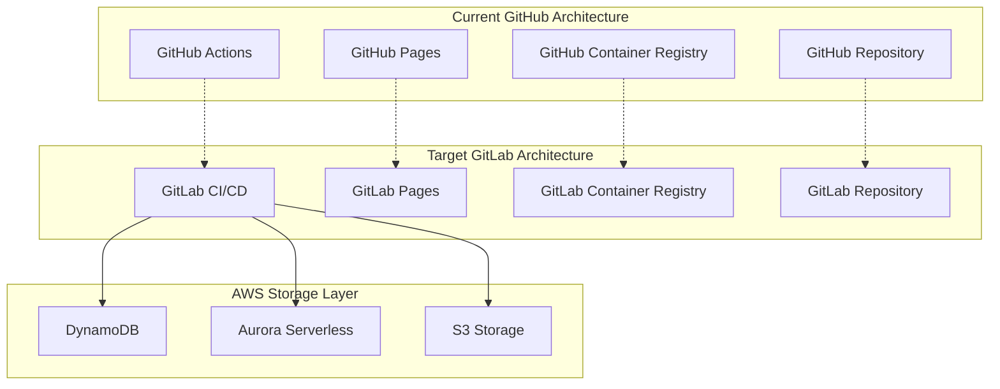
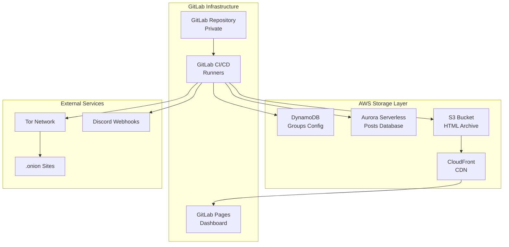

# GitHub to GitLab Migration Guide for Ransomwatch

## Platform Comparison Overview

This guide covers migrating ransomwatch from GitHub to GitLab, comparing features, costs, and implementation differences while exploring hybrid architectures that leverage GitLab CI/CD with AWS storage.



## Feature Mapping: GitHub vs GitLab

### Core Platform Features

| Feature | GitHub | GitLab | Migration Notes |
|---------|--------|--------|-----------------|
| **Repository Hosting** | GitHub Repos | GitLab Projects | Direct migration via git clone/push |
| **CI/CD** | GitHub Actions | GitLab CI/CD | YAML syntax differences |
| **Container Registry** | GitHub Container Registry | GitLab Container Registry | Docker images need re-push |
| **Static Hosting** | GitHub Pages | GitLab Pages | Similar functionality |
| **Issue Tracking** | GitHub Issues | GitLab Issues | Can be migrated |
| **Wiki** | GitHub Wiki | GitLab Wiki | Manual migration required |
| **Secrets Management** | GitHub Secrets | GitLab CI/CD Variables | Re-configure all secrets |

### CI/CD Comparison

#### GitHub Actions vs GitLab CI/CD

**GitHub Actions (Current):**
```yaml
name: ransomwatch
on:
  schedule:
    - cron: '0 */2 * * *'
  workflow_dispatch:

jobs:
  torsocks-job:
    runs-on: ubuntu-latest
    timeout-minutes: 90
    services:
      torproxy:
        image: ghcr.io/joshhighet/torsocc:latest
        ports:
        - 9050:9050
    steps:
      - name: checkout the repo
        uses: actions/checkout@v2
      - name: install dependencies
        run: pip3 install -r requirements.txt
      - name: run scraper
        run: python3 ransomwatch.py scrape
```

**GitLab CI/CD (Equivalent):**
```yaml
# .gitlab-ci.yml
stages:
  - scrape
  - parse
  - deploy

variables:
  DOCKER_DRIVER: overlay2
  DOCKER_TLS_CERTDIR: "/certs"

services:
  - name: registry.gitlab.com/your-username/torsocc:latest
    alias: torproxy
    command: ["tor", "-f", "/etc/tor/torrc"]

scrape_job:
  stage: scrape
  image: python:3.11
  timeout: 90m
  rules:
    - if: $CI_PIPELINE_SOURCE == "schedule"
    - if: $CI_PIPELINE_SOURCE == "web"
  before_script:
    - pip install -r requirements.txt
  script:
    - python3 ransomwatch.py scrape
  artifacts:
    paths:
      - source/
    expire_in: 1 hour

parse_job:
  stage: parse
  image: python:3.11
  dependencies:
    - scrape_job
  script:
    - python3 ransomwatch.py parse
  artifacts:
    paths:
      - posts.json
      - groups.json
    expire_in: 1 day

deploy_job:
  stage: deploy
  image: python:3.11
  dependencies:
    - parse_job
  script:
    - python3 ransomwatch.py markdown
    - python3 assets/groups-kv.py
  artifacts:
    paths:
      - docs/
  only:
    - main
```

### Key Differences in CI/CD

| Aspect | GitHub Actions | GitLab CI/CD | Migration Impact |
|--------|----------------|---------------|------------------|
| **Syntax** | `jobs` → `steps` | `stages` → `jobs` → `script` | Rewrite pipeline files |
| **Services** | `services:` in job | `services:` global | Minor syntax changes |
| **Artifacts** | Actions artifacts | Built-in artifacts | GitLab has better artifact management |
| **Caching** | `actions/cache` | `cache:` directive | GitLab caching is more flexible |
| **Secrets** | `${{ secrets.NAME }}` | `$CI_VARIABLE_NAME` | All secrets need reconfiguration |
| **Scheduling** | `schedule` trigger | Pipeline schedules (UI) | Configure in GitLab UI |
| **Matrix Builds** | `strategy.matrix` | `parallel.matrix` | Syntax differences |

## Cost Analysis: GitHub vs GitLab

### GitHub Costs (Current - Free Tier)

| Service | Free Tier Limit | Current Usage | Cost |
|---------|-----------------|---------------|------|
| **Actions Minutes** | 2,000 min/month | ~720 min/month | $0 |
| **Storage** | 500MB | ~100MB | $0 |
| **Container Registry** | 500MB | ~200MB | $0 |
| **Pages** | Unlimited (public) | Unlimited | $0 |
| **Total** | | | **$0/month** |

### GitLab Costs (Private Repository)

#### GitLab SaaS Pricing

| Tier | Price | CI/CD Minutes | Storage | Container Registry |
|------|-------|---------------|---------|-------------------|
| **Free** | $0 | 400 min/month | 5GB | 5GB |
| **Premium** | $19/user/month | 10,000 min/month | 50GB | 50GB |
| **Ultimate** | $99/user/month | 50,000 min/month | 250GB | 250GB |

#### Cost Analysis for Ransomwatch

**Current Usage:**
- CI/CD Minutes: ~720 minutes/month (30 min × 24 runs)
- Storage: ~100MB repository + artifacts
- Container Registry: ~200MB for Tor proxy image

**GitLab Requirements:**
- **Free Tier**: ❌ Only 400 minutes (need 720)
- **Premium Tier**: ✅ 10,000 minutes available
- **Cost**: $19/month for private repository

### Cost Comparison Summary

| Platform | Repository Type | Monthly Cost | Annual Cost |
|----------|----------------|--------------|-------------|
| **GitHub** | Public | $0 | $0 |
| **GitLab** | Private | $19 | $228 |
| **GitHub** | Private | $4/user | $48 |

**Key Insight**: GitLab private repos are more expensive than GitHub private repos ($19 vs $4/month).

## Security Implications

### GitHub Security (Current)

**Advantages:**
- ✅ Public repository provides transparency
- ✅ Community security reviews
- ✅ GitHub's security scanning (Dependabot, CodeQL)
- ✅ Large ecosystem and security tooling

**Disadvantages:**
- ❌ All code and configuration visible
- ❌ Execution logs may expose sensitive information
- ❌ Predictable execution patterns

### GitLab Security (Private Repository)

**Advantages:**
- ✅ **Private repository** hides implementation details
- ✅ **Better secrets management** with environment-specific variables
- ✅ **Advanced security features** (SAST, DAST, dependency scanning)
- ✅ **Compliance features** (audit logs, approval workflows)
- ✅ **Network security** with GitLab-managed runners in private networks

**Enhanced Security Features:**
```yaml
# .gitlab-ci.yml with security scanning
include:
  - template: Security/SAST.gitlab-ci.yml
  - template: Security/Secret-Detection.gitlab-ci.yml
  - template: Security/Dependency-Scanning.gitlab-ci.yml

variables:
  SAST_EXCLUDED_PATHS: "spec, test, tests, tmp"
  SECRET_DETECTION_EXCLUDED_PATHS: "docs/"

security_scan:
  stage: test
  script:
    - echo "Security scanning enabled"
  artifacts:
    reports:
      sast: gl-sast-report.json
      secret_detection: gl-secret-detection-report.json
```

### Security Recommendations for Private GitLab

#### 1. Enhanced Secrets Management
```yaml
# Environment-specific variables
variables:
  ENVIRONMENT: "production"

scrape_job:
  script:
    - python3 ransomwatch.py scrape
  environment:
    name: production
    url: https://ransomwatch.example.com
  variables:
    DISCORD_WEBHOOK: $PROD_DISCORD_WEBHOOK
    AWS_ACCESS_KEY_ID: $PROD_AWS_ACCESS_KEY
    AWS_SECRET_ACCESS_KEY: $PROD_AWS_SECRET_KEY
```

#### 2. Network Isolation
```yaml
# Use private GitLab runners
scrape_job:
  tags:
    - private-runner
    - docker
  script:
    - python3 ransomwatch.py scrape
```

#### 3. Audit and Compliance
```yaml
# Approval workflows for production
deploy_production:
  stage: deploy
  script:
    - python3 deploy.py
  environment:
    name: production
  when: manual
  allow_failure: false
  rules:
    - if: $CI_COMMIT_BRANCH == "main"
```

## Hybrid Architecture: GitLab CI/CD + AWS Storage

### Architecture Overview



### Implementation Strategy

#### 1. GitLab CI/CD Pipeline with AWS Integration

```yaml
# .gitlab-ci.yml
stages:
  - setup
  - scrape
  - parse
  - deploy

variables:
  AWS_DEFAULT_REGION: us-west-2
  DOCKER_DRIVER: overlay2

# Setup AWS CLI and dependencies
setup_job:
  stage: setup
  image: python:3.11
  before_script:
    - pip install awscli boto3 psycopg2-binary
  script:
    - aws --version
    - python3 -c "import boto3; print('AWS SDK ready')"
  artifacts:
    paths:
      - .aws/
    expire_in: 1 hour

# Scraping with Tor proxy
scrape_job:
  stage: scrape
  image: python:3.11
  services:
    - name: registry.gitlab.com/your-username/torsocc:latest
      alias: torproxy
  dependencies:
    - setup_job
  timeout: 90m
  before_script:
    - pip install -r requirements.txt
    - export TOR_PROXY_HOST=torproxy
    - export TOR_PROXY_PORT=9050
  script:
    # Load groups from DynamoDB
    - python3 scripts/load_groups_from_dynamodb.py
    # Run scraping
    - python3 ransomwatch.py scrape
    # Upload HTML to S3
    - python3 scripts/upload_html_to_s3.py
  artifacts:
    paths:
      - source/
    expire_in: 2 hours
  rules:
    - if: $CI_PIPELINE_SOURCE == "schedule"
    - if: $CI_PIPELINE_SOURCE == "web"

# Parsing and database updates
parse_job:
  stage: parse
  image: python:3.11
  dependencies:
    - scrape_job
  script:
    # Download HTML from S3 if needed
    - python3 scripts/download_html_from_s3.py
    # Run parsers
    - python3 ransomwatch.py parse
    # Save posts to Aurora
    - python3 scripts/save_posts_to_aurora.py
    # Send notifications
    - python3 scripts/send_notifications.py
  artifacts:
    reports:
      junit: test-results.xml
    paths:
      - logs/
    expire_in: 1 day

# Generate and deploy documentation
deploy_job:
  stage: deploy
  image: python:3.11
  dependencies:
    - parse_job
  script:
    # Generate markdown from AWS data
    - python3 scripts/generate_docs_from_aws.py
    # Create visualizations
    - python3 plotting.py
    # Deploy to GitLab Pages
    - mkdir public
    - cp -r docs/* public/
  artifacts:
    paths:
      - public
  only:
    - main
```

#### 2. AWS Integration Scripts

**Load Groups from DynamoDB:**
```python
# scripts/load_groups_from_dynamodb.py
import boto3
import json
import os

def load_groups_from_dynamodb():
    """Load groups configuration from DynamoDB"""
    dynamodb = boto3.resource('dynamodb', region_name=os.environ['AWS_DEFAULT_REGION'])
    table = dynamodb.Table(os.environ['DYNAMODB_GROUPS_TABLE'])
    
    response = table.scan()
    groups = response['Items']
    
    # Save to local file for compatibility
    with open('groups.json', 'w') as f:
        json.dump(groups, f, indent=2, default=str)
    
    print(f"Loaded {len(groups)} groups from DynamoDB")
    return groups

if __name__ == "__main__":
    load_groups_from_dynamodb()
```

**Upload HTML to S3:**
```python
# scripts/upload_html_to_s3.py
import boto3
import os
from datetime import datetime
import glob

def upload_html_to_s3():
    """Upload scraped HTML files to S3"""
    s3_client = boto3.client('s3')
    bucket = os.environ['S3_BUCKET']
    
    # Get today's date for S3 key prefix
    today = datetime.now()
    prefix = f"html-sources/{today.year}/{today.month:02d}/{today.day:02d}/"
    
    html_files = glob.glob('source/*.html')
    
    for html_file in html_files:
        filename = os.path.basename(html_file)
        s3_key = f"{prefix}{filename}"
        
        with open(html_file, 'rb') as f:
            s3_client.put_object(
                Bucket=bucket,
                Key=s3_key,
                Body=f.read(),
                ContentType='text/html',
                Metadata={
                    'scraped_at': today.isoformat(),
                    'pipeline_id': os.environ.get('CI_PIPELINE_ID', 'unknown')
                }
            )
        
        print(f"Uploaded {html_file} to s3://{bucket}/{s3_key}")

if __name__ == "__main__":
    upload_html_to_s3()
```

**Save Posts to Aurora:**
```python
# scripts/save_posts_to_aurora.py
import psycopg2
import json
import os
from datetime import datetime

def save_posts_to_aurora():
    """Save parsed posts to Aurora PostgreSQL"""
    
    # Connect to Aurora
    conn = psycopg2.connect(
        host=os.environ['AURORA_ENDPOINT'],
        database=os.environ['AURORA_DATABASE'],
        user=os.environ['AURORA_USERNAME'],
        password=os.environ['AURORA_PASSWORD'],
        port=5432
    )
    
    # Load posts from local file (generated by parsers)
    with open('posts.json', 'r') as f:
        posts = json.load(f)
    
    new_posts = 0
    
    with conn.cursor() as cur:
        for post in posts:
            try:
                cur.execute("""
                    INSERT INTO posts (post_title, group_name, discovered, pipeline_id)
                    VALUES (%s, %s, %s, %s)
                    ON CONFLICT (post_title, group_name) DO NOTHING
                    RETURNING id
                """, (
                    post['post_title'],
                    post['group_name'],
                    post['discovered'],
                    os.environ.get('CI_PIPELINE_ID')
                ))
                
                if cur.fetchone():
                    new_posts += 1
                    
            except Exception as e:
                print(f"Error inserting post {post['post_title']}: {e}")
    
    conn.commit()
    conn.close()
    
    print(f"Saved {new_posts} new posts to Aurora")
    
    # Set GitLab CI variable for notifications
    with open('new_posts_count.txt', 'w') as f:
        f.write(str(new_posts))

if __name__ == "__main__":
    save_posts_to_aurora()
```

#### 3. GitLab Pages Integration

**Generate Documentation from AWS:**
```python
# scripts/generate_docs_from_aws.py
import boto3
import psycopg2
import json
from datetime import datetime

def generate_docs_from_aws():
    """Generate documentation using data from AWS"""
    
    # Connect to Aurora for posts data
    conn = psycopg2.connect(
        host=os.environ['AURORA_ENDPOINT'],
        database=os.environ['AURORA_DATABASE'],
        user=os.environ['AURORA_USERNAME'],
        password=os.environ['AURORA_PASSWORD']
    )
    
    # Connect to DynamoDB for groups data
    dynamodb = boto3.resource('dynamodb')
    groups_table = dynamodb.Table(os.environ['DYNAMODB_GROUPS_TABLE'])
    
    # Generate main dashboard
    generate_main_dashboard(conn, groups_table)
    
    # Generate group profiles
    generate_group_profiles(conn, groups_table)
    
    # Generate recent posts
    generate_recent_posts(conn)
    
    conn.close()

def generate_main_dashboard(conn, groups_table):
    """Generate main dashboard page"""
    
    # Get statistics from Aurora
    with conn.cursor() as cur:
        cur.execute("SELECT COUNT(*) FROM posts")
        total_posts = cur.fetchone()[0]
        
        cur.execute("""
            SELECT COUNT(*) FROM posts 
            WHERE discovered >= CURRENT_TIMESTAMP - INTERVAL '24 hours'
        """)
        posts_24h = cur.fetchone()[0]
        
        cur.execute("""
            SELECT COUNT(*) FROM posts 
            WHERE discovered >= CURRENT_TIMESTAMP - INTERVAL '30 days'
        """)
        posts_30d = cur.fetchone()[0]
    
    # Get group count from DynamoDB
    groups_response = groups_table.scan(Select='COUNT')
    total_groups = groups_response['Count']
    
    # Generate markdown
    dashboard_content = f"""# Ransomwatch Dashboard

## Summary
_Updated: {datetime.now().strftime('%B %d, %Y')}_

- **Total Posts**: {total_posts:,}
- **Posts (24h)**: {posts_24h}
- **Posts (30d)**: {posts_30d}
- **Active Groups**: {total_groups}

## Recent Activity
[View Recent Posts](recent-posts.html)

## Group Profiles
[View All Groups](group-profiles.html)
"""
    
    os.makedirs('docs', exist_ok=True)
    with open('docs/index.md', 'w') as f:
        f.write(dashboard_content)

if __name__ == "__main__":
    generate_docs_from_aws()
```

### Cost Analysis: GitLab + AWS Hybrid

#### GitLab Costs
| Service | Cost |
|---------|------|
| **GitLab Premium** | $19/month |
| **Additional CI Minutes** | $0 (10,000 included) |
| **Storage** | $0 (50GB included) |

#### AWS Costs
| Service | Configuration | Monthly Cost |
|---------|---------------|--------------|
| **DynamoDB** | On-demand, groups config | $2-5 |
| **Aurora Serverless v2** | 0.5-2 ACUs | $15-30 |
| **S3** | 50GB + Intelligent Tiering | $8-15 |
| **CloudFront** | CDN for GitLab Pages | $5-10 |
| **Data Transfer** | Minimal within AWS | $2-5 |

#### Total Monthly Cost
- **GitLab**: $19
- **AWS**: $32-65
- **Total**: $51-84/month

**Comparison with Current GitHub (Free): +$51-84/month**

## Migration Steps

### Phase 1: Repository Migration (Week 1)

#### 1. Create GitLab Repository
```bash
# Create new GitLab project
# Via GitLab UI: New Project → Import from GitHub

# Or manual migration:
git clone https://github.com/joshhighet/ransomwatch.git
cd ransomwatch
git remote add gitlab https://gitlab.com/your-username/ransomwatch.git
git push gitlab main
```

#### 2. Migrate Container Images
```bash
# Pull from GitHub Container Registry
docker pull ghcr.io/joshhighet/torsocc:latest

# Tag for GitLab Container Registry
docker tag ghcr.io/joshhighet/torsocc:latest registry.gitlab.com/your-username/ransomwatch/torsocc:latest

# Push to GitLab Container Registry
docker push registry.gitlab.com/your-username/ransomwatch/torsocc:latest
```

#### 3. Configure GitLab CI/CD Variables
```bash
# Via GitLab UI: Settings → CI/CD → Variables
DISCORD_WEBHOOK: <webhook_url>
AWS_ACCESS_KEY_ID: <access_key>
AWS_SECRET_ACCESS_KEY: <secret_key>
AURORA_ENDPOINT: <aurora_endpoint>
AURORA_USERNAME: <username>
AURORA_PASSWORD: <password>
DYNAMODB_GROUPS_TABLE: ransomwatch-groups
S3_BUCKET: ransomwatch-data
```

### Phase 2: AWS Infrastructure Setup (Week 1-2)

#### 1. Deploy AWS Resources
```bash
# Use Terraform from serverless-lambda-architecture.md
terraform init
terraform plan -var="environment=gitlab"
terraform apply
```

#### 2. Migrate Data to AWS
```python
# Run migration scripts
python3 scripts/migrate_groups_to_dynamodb.py
python3 scripts/migrate_posts_to_aurora.py
python3 scripts/migrate_html_to_s3.py
```

### Phase 3: Pipeline Configuration (Week 2)

#### 1. Create GitLab CI/CD Pipeline
```bash
# Copy .gitlab-ci.yml to repository root
cp examples/gitlab-ci.yml .gitlab-ci.yml
git add .gitlab-ci.yml
git commit -m "Add GitLab CI/CD pipeline"
git push gitlab main
```

#### 2. Configure Pipeline Schedules
```bash
# Via GitLab UI: CI/CD → Schedules
# Create schedule: "0 */2 * * *" (every 2 hours)
# Target branch: main
# Variables: PIPELINE_SOURCE=schedule
```

### Phase 4: Testing and Validation (Week 3)

#### 1. Test Pipeline Execution
```bash
# Trigger manual pipeline
# Via GitLab UI: CI/CD → Pipelines → Run Pipeline

# Monitor execution
# Check job logs for errors
# Validate data in AWS services
```

#### 2. Validate GitLab Pages
```bash
# Check GitLab Pages deployment
# URL: https://your-username.gitlab.io/ransomwatch
# Verify dashboard and data accuracy
```

### Phase 5: DNS and Go-Live (Week 4)

#### 1. Update DNS
```bash
# Update CNAME record
# From: ransomwatch.telemetry.ltd → your-username.github.io
# To: ransomwatch.telemetry.ltd → your-username.gitlab.io
```

#### 2. Monitor and Optimize
```bash
# Monitor pipeline performance
# Optimize CI/CD execution times
# Fine-tune AWS resource allocation
```

## Advantages of GitLab Migration

### Security Benefits
- ✅ **Private repository** hides implementation details
- ✅ **Enhanced secrets management** with environment scoping
- ✅ **Built-in security scanning** (SAST, DAST, dependency scanning)
- ✅ **Compliance features** (audit logs, approval workflows)
- ✅ **Better access controls** and user management

### Operational Benefits
- ✅ **Integrated DevOps platform** (single tool for everything)
- ✅ **Better artifact management** and caching
- ✅ **Advanced pipeline features** (parallel jobs, dependencies)
- ✅ **Built-in monitoring** and performance metrics
- ✅ **Professional support** with Premium tier

### Technical Benefits
- ✅ **More flexible CI/CD** syntax and features
- ✅ **Better container registry** integration
- ✅ **Advanced deployment strategies** (blue-green, canary)
- ✅ **Integrated package management** (npm, Maven, etc.)

## Disadvantages and Considerations

### Cost Impact
- ❌ **Monthly cost**: $51-84 vs $0 (GitHub free)
- ❌ **Complexity**: Additional AWS services to manage
- ❌ **Learning curve**: New platform and tools

### Migration Challenges
- ❌ **Pipeline rewrite**: Complete CI/CD reconfiguration
- ❌ **Secret migration**: All credentials need reconfiguration
- ❌ **URL changes**: GitLab Pages has different URL structure
- ❌ **Community**: Smaller ecosystem compared to GitHub

## Recommendation

### When to Choose GitLab Migration

**Choose GitLab if:**
- ✅ **Security is paramount** (private repository required)
- ✅ **Budget allows** $50-80/month operational cost
- ✅ **Advanced DevOps features** are needed
- ✅ **Compliance requirements** exist
- ✅ **Professional support** is required

**Stay with GitHub if:**
- ✅ **Cost is primary concern** (free tier sufficient)
- ✅ **Public transparency** is acceptable
- ✅ **Current setup works well**
- ✅ **Community engagement** is important

### Hybrid Approach (Recommended)

Consider a **hybrid approach**:
1. **Keep GitHub for public transparency** and community
2. **Use GitLab for private development** and testing
3. **Deploy production from GitLab** with enhanced security
4. **Sync repositories** between platforms

This provides the best of both worlds: community engagement on GitHub and enterprise security on GitLab.