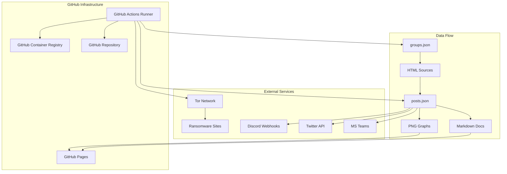
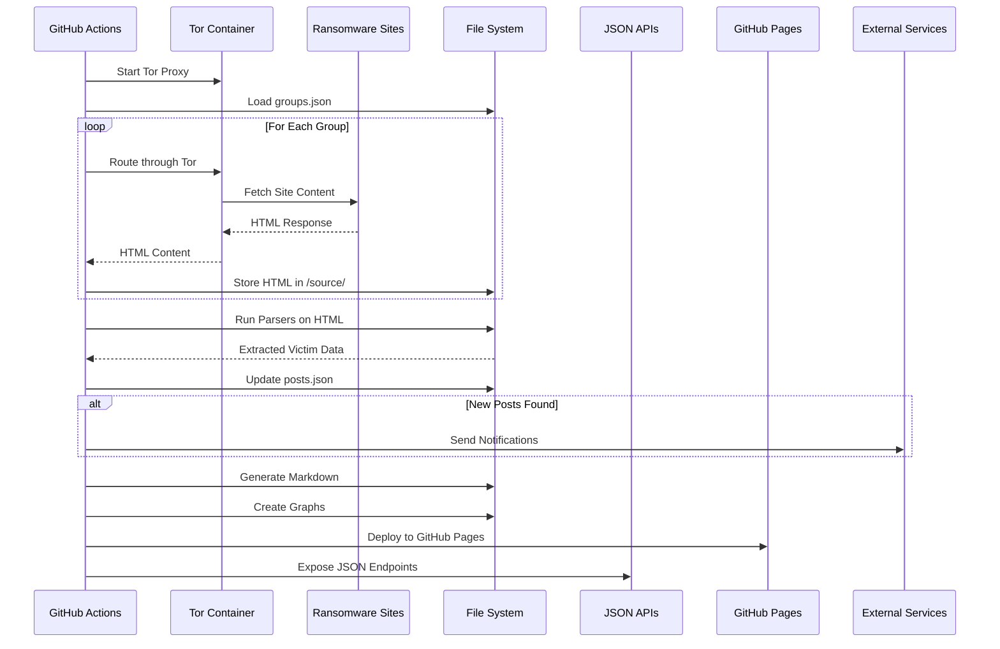
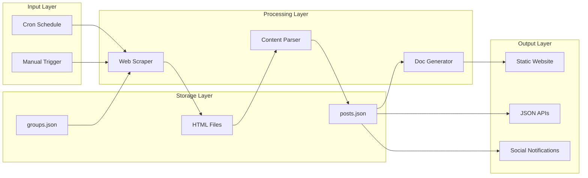
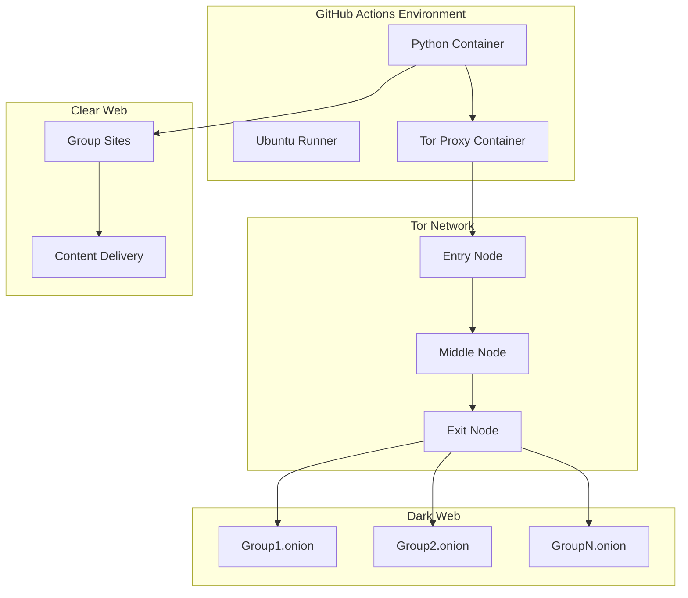
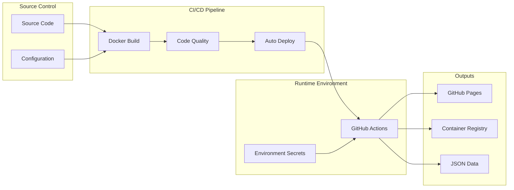
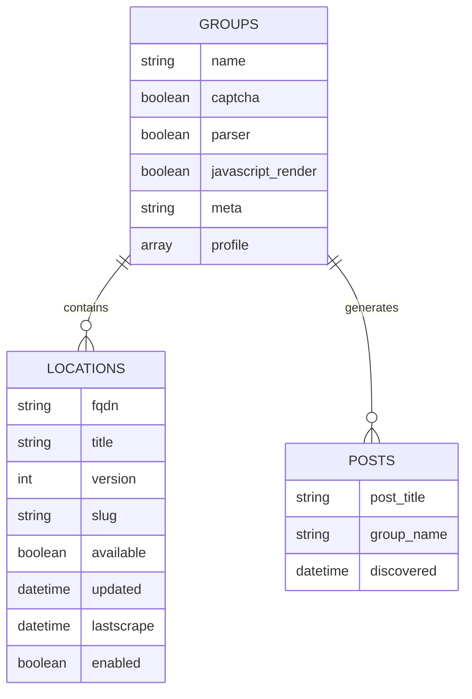
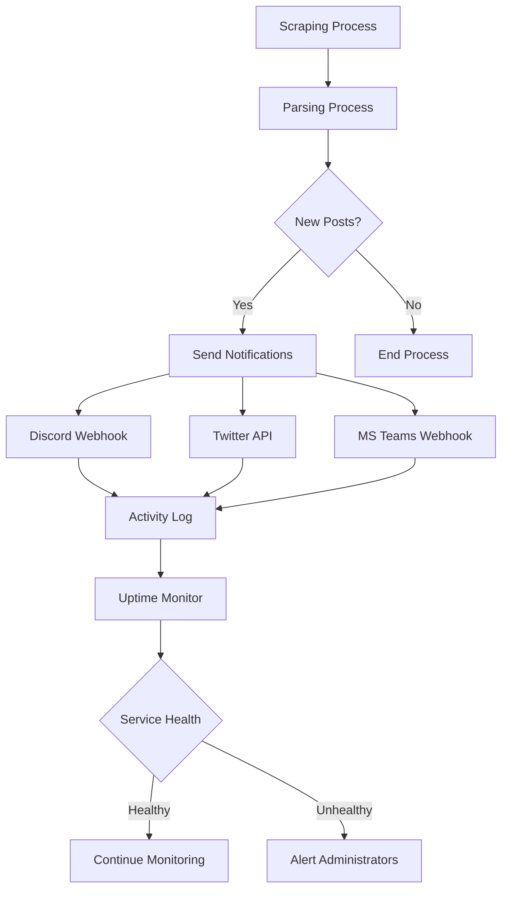
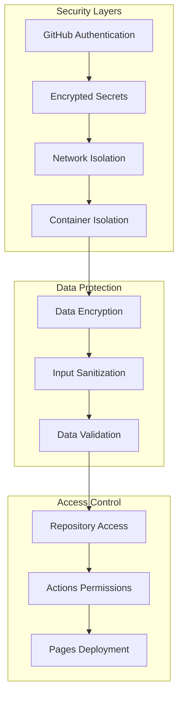

# Infrastructure Diagrams

## System Architecture Overview

## Data Flow Architecture

## Component Interaction Diagram

## Network Architecture

## Deployment Pipeline

## Data Storage Architecture

## Monitoring and Alerting Flow

## Security Architecture

