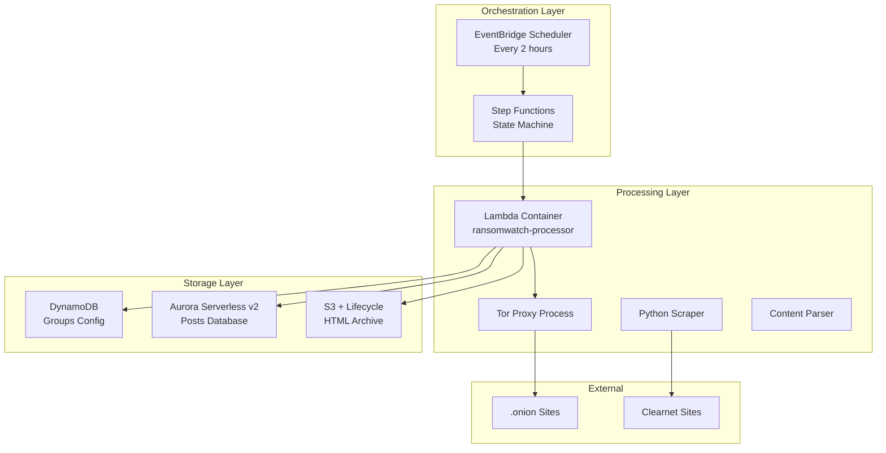
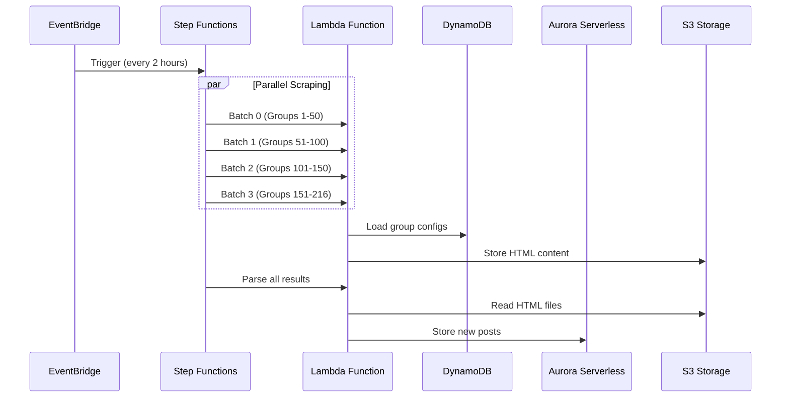
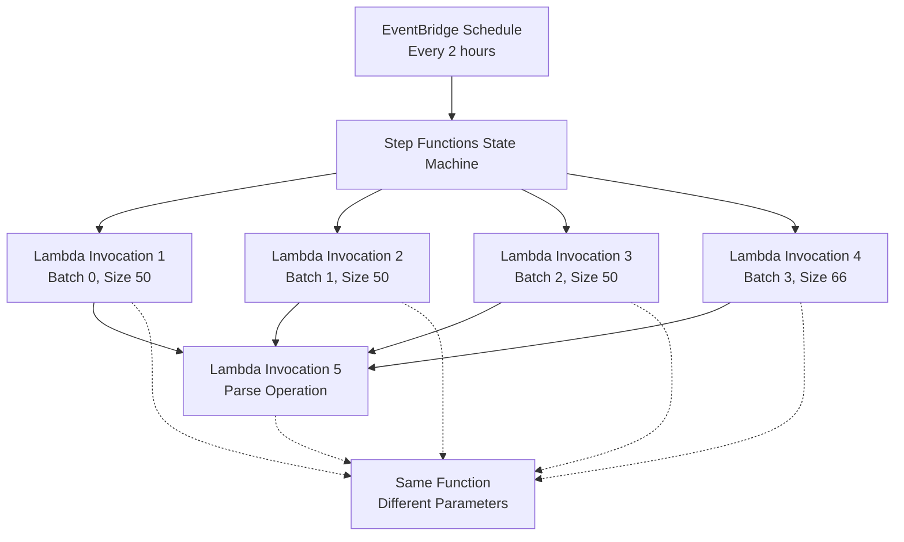

# Serverless Lambda Architecture for Ransomwatch

## Architecture Overview

This serverless architecture leverages AWS Lambda with Step Functions orchestration to handle the 30-minute runtime limitation while providing superior performance, cost efficiency, and reliability.



## Cost Analysis

### Optimized Serverless Architecture

| Service | Configuration | Monthly Cost |
|---------|---------------|--------------|
| **Lambda** | 5 invocations × 8min avg × 12 runs/day × 30 days | $20-30 |
| | 3008MB memory, ARM64 | |
| **Step Functions** | 5 transitions × 360 executions/month | $1.25 |
| **S3 Storage** | 50GB HTML + Intelligent Tiering | $6-12 |
| **DynamoDB** | On-demand, groups config (~10K reads/writes) | $2-5 |
| **Aurora Serverless v2** | 0.5 ACU min, posts database | $15-25 |
| **EventBridge** | 360 scheduled events/month | $0.36 |
| **CloudWatch** | Logs + metrics | $3-8 |
| **Data Transfer** | Minimal (within AWS) | $2-5 |
| **Total** | | **$49-86/month** |

**Key Benefits:**
- **3x faster execution**: 10 minutes vs 30 minutes (parallel processing)
- **Better reliability**: Isolated batch failures with automatic retries
- **Scalable storage**: Aurora auto-scales, S3 lifecycle management
- **No infrastructure management**: Fully serverless

## Step Functions + Lambda Architecture

### Why This Approach Solves the 30-Minute Problem

**Challenge**: AWS Lambda has a hard 15-minute execution limit, but ransomwatch needs ~30 minutes.

**Solution**: Step Functions orchestrates parallel Lambda executions:
- **4 parallel scraping batches** (8-10 minutes each)
- **1 sequential parsing operation** (3-5 minutes)
- **Total execution time**: ~10-12 minutes vs 30 minutes

### Execution Flow



## Detailed Implementation

### Lambda Container Image Architecture

#### Dockerfile
```dockerfile
FROM public.ecr.aws/lambda/python:3.11

# Install system dependencies
RUN yum update -y && \
    yum install -y tor firefox gcc && \
    yum clean all

# Install geckodriver
RUN curl -L "https://github.com/mozilla/geckodriver/releases/latest/download/geckodriver-v0.33.0-linux64.tar.gz" | \
    tar -xz -C /usr/local/bin && \
    chmod +x /usr/local/bin/geckodriver

# Copy Tor configuration
COPY torrc /etc/tor/torrc

# Copy application code
COPY requirements.txt ${LAMBDA_TASK_ROOT}
RUN pip install -r requirements.txt

COPY *.py ${LAMBDA_TASK_ROOT}/
COPY assets/ ${LAMBDA_TASK_ROOT}/assets/

# Lambda handler
CMD ["lambda_handler.handler"]
```

#### Tor Configuration (`torrc`)
```
# Minimal Tor config for Lambda
SocksPort 127.0.0.1:9050
DataDirectory /tmp/tor
Log notice stdout
ControlPort 0
CookieAuthentication 0

# Performance optimizations for Lambda
CircuitBuildTimeout 15
LearnCircuitBuildTimeout 0
MaxCircuitDirtiness 300
NewCircuitPeriod 30

# No exit traffic
ExitPolicy reject *:*
```

#### Lambda Handler (`lambda_handler.py`)
```python
import json
import subprocess
import time
import threading
import boto3
from datetime import datetime
import os

# Import existing ransomwatch modules
import ransomwatch
import parsers
from sharedutils import stdlog, errlog

s3_client = boto3.client('s3')
dynamodb = boto3.resource('dynamodb')

def start_tor():
    """Start Tor process in background"""
    try:
        # Create tor data directory
        os.makedirs('/tmp/tor', exist_ok=True, mode=0o700)
        
        # Start Tor process
        tor_process = subprocess.Popen([
            'tor', '-f', '/etc/tor/torrc'
        ], stdout=subprocess.PIPE, stderr=subprocess.PIPE)
        
        # Wait for Tor to bootstrap
        time.sleep(10)
        
        # Verify Tor is running
        if tor_process.poll() is None:
            stdlog("Tor started successfully")
            return tor_process
        else:
            errlog("Tor failed to start")
            return None
            
    except Exception as e:
        errlog(f"Error starting Tor: {e}")
        return None

def handler(event, context):
    """Main Lambda handler"""
    start_time = time.time()
    
    try:
        # Start Tor proxy
        tor_process = start_tor()
        if not tor_process:
            return {
                'statusCode': 500,
                'body': json.dumps('Failed to start Tor')
            }
        
        # Determine operation mode from event
        operation = event.get('operation', 'full_run')
        
        if operation == 'scrape_only':
            result = run_scraper()
        elif operation == 'parse_only':
            result = run_parser()
        else:
            # Full pipeline
            scrape_result = run_scraper()
            parse_result = run_parser()
            result = {
                'scrape': scrape_result,
                'parse': parse_result
            }
        
        execution_time = time.time() - start_time
        stdlog(f"Lambda execution completed in {execution_time:.2f} seconds")
        
        return {
            'statusCode': 200,
            'body': json.dumps({
                'message': 'Success',
                'execution_time': execution_time,
                'result': result
            })
        }
        
    except Exception as e:
        errlog(f"Lambda execution failed: {e}")
        return {
            'statusCode': 500,
            'body': json.dumps(f'Error: {str(e)}')
        }
    
    finally:
        # Clean up Tor process
        if 'tor_process' in locals() and tor_process:
            tor_process.terminate()

def run_scraper():
    """Execute scraping logic"""
    # Load groups from DynamoDB
    groups = load_groups_from_dynamodb()
    
    results = {
        'sites_scraped': 0,
        'sites_successful': 0,
        'sites_failed': 0
    }
    
    for group in groups:
        for location in group['locations']:
            try:
                # Use existing scraping logic
                html_content = scrape_site(location['slug'])
                
                if html_content:
                    # Save to S3
                    save_html_to_s3(group['name'], location['fqdn'], html_content)
                    
                    # Update metadata in DynamoDB
                    update_site_status(group['name'], location['fqdn'], True)
                    
                    results['sites_successful'] += 1
                else:
                    update_site_status(group['name'], location['fqdn'], False)
                    results['sites_failed'] += 1
                    
                results['sites_scraped'] += 1
                
            except Exception as e:
                errlog(f"Failed to scrape {location['slug']}: {e}")
                results['sites_failed'] += 1
    
    return results

def save_html_to_s3(group_name, fqdn, content):
    """Save HTML content to S3 with proper key structure"""
    timestamp = datetime.now()
    key = f"html-sources/{timestamp.year}/{timestamp.month:02d}/{timestamp.day:02d}/{group_name}-{fqdn}-{int(timestamp.timestamp())}.html"
    
    s3_client.put_object(
        Bucket=os.environ['S3_BUCKET'],
        Key=key,
        Body=content.encode('utf-8'),
        ContentType='text/html',
        Metadata={
            'group_name': group_name,
            'fqdn': fqdn,
            'scraped_at': timestamp.isoformat()
        }
    )
    
    return key
```

### Data Storage Architecture

#### DynamoDB for Groups Configuration
```python
# Groups table - stores ransomware group configurations
groups_table = {
    'TableName': 'ransomwatch-groups',
    'KeySchema': [
        {'AttributeName': 'group_name', 'KeyType': 'HASH'}
    ],
    'AttributeDefinitions': [
        {'AttributeName': 'group_name', 'AttributeType': 'S'}
    ],
    'BillingMode': 'ON_DEMAND'
}

# Example group configuration
group_item = {
    'group_name': 'lockbit3',
    'captcha': False,
    'parser': True,
    'javascript_render': False,
    'meta': 'LockBit 3.0 ransomware group',
    'locations': [
        {
            'fqdn': 'lockbitapt6vx4ekld5ycu47qtd3qonzjqqgl6owhbc2oc2hctuca62ad.onion',
            'title': 'LockBit 3.0',
            'version': 3,
            'slug': 'http://lockbitapt6vx4ekld5ycu47qtd3qonzjqqgl6owhbc2oc2hctuca62ad.onion',
            'available': True,
            'last_scrape': '2025-06-17T12:00:00Z',
            'enabled': True
        }
    ],
    'profile': ['https://example.com/analysis'],
    'updated_at': '2025-06-17T12:00:00Z'
}
```

#### Aurora Serverless v2 for Posts Database
```sql
-- Posts table schema for Aurora PostgreSQL
CREATE TABLE posts (
    id BIGSERIAL PRIMARY KEY,
    post_title VARCHAR(255) NOT NULL,
    group_name VARCHAR(100) NOT NULL,
    discovered TIMESTAMP WITH TIME ZONE DEFAULT CURRENT_TIMESTAMP,
    content_hash VARCHAR(64),
    s3_key VARCHAR(500),
    created_at TIMESTAMP WITH TIME ZONE DEFAULT CURRENT_TIMESTAMP,
    
    -- Ensure no duplicate posts
    UNIQUE(post_title, group_name)
);

-- Indexes for efficient queries
CREATE INDEX idx_posts_group_discovered ON posts(group_name, discovered DESC);
CREATE INDEX idx_posts_discovered ON posts(discovered DESC);
CREATE INDEX idx_posts_group ON posts(group_name);

-- Groups metadata table (synced from DynamoDB)
CREATE TABLE groups_metadata (
    group_name VARCHAR(100) PRIMARY KEY,
    total_posts INTEGER DEFAULT 0,
    last_post_date TIMESTAMP WITH TIME ZONE,
    first_seen TIMESTAMP WITH TIME ZONE,
    updated_at TIMESTAMP WITH TIME ZONE DEFAULT CURRENT_TIMESTAMP
);
```

**Why Aurora Serverless v2 for Posts:**
- **Auto-scaling**: Scales from 0.5 to 128 ACUs based on demand
- **Cost-effective**: Pay only for actual usage
- **ACID compliance**: Ensures data consistency for posts
- **Advanced queries**: Complex analytics and reporting
- **Backup/restore**: Point-in-time recovery

#### S3 Intelligent Tiering for HTML Archive
```json
{
    "Rules": [
        {
            "ID": "HTMLSourcesIntelligentTiering",
            "Status": "Enabled",
            "Filter": {
                "Prefix": "html-sources/"
            },
            "Transitions": [
                {
                    "Days": 0,
                    "StorageClass": "INTELLIGENT_TIERING"
                }
            ]
        },
        {
            "ID": "HTMLSourcesLifecycle", 
            "Status": "Enabled",
            "Filter": {
                "Prefix": "html-sources/"
            },
            "Transitions": [
                {
                    "Days": 90,
                    "StorageClass": "GLACIER_IR"
                },
                {
                    "Days": 180,
                    "StorageClass": "GLACIER"
                },
                {
                    "Days": 365,
                    "StorageClass": "DEEP_ARCHIVE"
                }
            ]
        },
        {
            "ID": "DeleteOldLogs",
            "Status": "Enabled", 
            "Filter": {
                "Prefix": "logs/"
            },
            "Expiration": {
                "Days": 90
            }
        }
    ]
}
```

**S3 Storage Strategy:**
- **Intelligent Tiering**: Automatically moves data between access tiers
- **Immediate access**: Recent HTML files (0-90 days) in Standard/IA
- **Archive storage**: Older files moved to Glacier for cost savings
- **Key structure**: `html-sources/YYYY/MM/DD/group-fqdn-timestamp.html`

### EventBridge Scheduling

#### Terraform Configuration
```hcl
resource "aws_cloudwatch_event_rule" "ransomwatch_scrape" {
  name                = "ransomwatch-scrape-schedule"
  description         = "Trigger ransomwatch scraping every 2 hours"
  schedule_expression = "rate(2 hours)"
}

resource "aws_cloudwatch_event_rule" "ransomwatch_parse" {
  name                = "ransomwatch-parse-schedule"
  description         = "Trigger ransomwatch parsing 15 minutes after scraping"
  schedule_expression = "cron(15 */2 * * ? *)"
}

resource "aws_cloudwatch_event_target" "lambda_scrape_target" {
  rule      = aws_cloudwatch_event_rule.ransomwatch_scrape.name
  target_id = "RansomwatchScrapeTarget"
  arn       = aws_lambda_function.ransomwatch.arn
  
  input = jsonencode({
    operation = "scrape_only"
  })
}

resource "aws_cloudwatch_event_target" "lambda_parse_target" {
  rule      = aws_cloudwatch_event_rule.ransomwatch_parse.name
  target_id = "RansomwatchParseTarget"
  arn       = aws_lambda_function.ransomwatch.arn
  
  input = jsonencode({
    operation = "parse_only"
  })
}
```

### Complete Infrastructure as Code

#### Terraform Configuration
```hcl
# Lambda Function
resource "aws_lambda_function" "ransomwatch_processor" {
  function_name = "ransomwatch-processor"
  role         = aws_iam_role.lambda_execution_role.arn
  
  package_type = "Image"
  image_uri    = "${aws_ecr_repository.ransomwatch.repository_url}:latest"
  
  memory_size   = 3008  # Maximum for better CPU allocation
  timeout       = 900   # 15 minutes
  architectures = ["arm64"]
  
  environment {
    variables = {
      S3_BUCKET       = aws_s3_bucket.ransomwatch.bucket
      GROUPS_TABLE    = aws_dynamodb_table.groups.name
      AURORA_ENDPOINT = aws_rds_cluster.aurora.endpoint
      AURORA_DATABASE = aws_rds_cluster.aurora.database_name
      AURORA_USERNAME = aws_rds_cluster.aurora.master_username
    }
  }
}

# DynamoDB Table for Groups
resource "aws_dynamodb_table" "groups" {
  name           = "ransomwatch-groups"
  billing_mode   = "ON_DEMAND"
  hash_key       = "group_name"

  attribute {
    name = "group_name"
    type = "S"
  }

  tags = {
    Name = "ransomwatch-groups"
  }
}

# Aurora Serverless v2 Cluster
resource "aws_rds_cluster" "aurora" {
  cluster_identifier      = "ransomwatch-aurora"
  engine                 = "aurora-postgresql"
  engine_mode            = "provisioned"
  engine_version         = "15.4"
  database_name          = "ransomwatch"
  master_username        = "postgres"
  manage_master_user_password = true
  
  serverlessv2_scaling_configuration {
    max_capacity = 16
    min_capacity = 0.5
  }
  
  skip_final_snapshot = true
  
  tags = {
    Name = "ransomwatch-aurora"
  }
}

resource "aws_rds_cluster_instance" "aurora_instance" {
  identifier         = "ransomwatch-aurora-instance"
  cluster_identifier = aws_rds_cluster.aurora.id
  instance_class     = "db.serverless"
  engine             = aws_rds_cluster.aurora.engine
  engine_version     = aws_rds_cluster.aurora.engine_version
}

# S3 Bucket with Intelligent Tiering
resource "aws_s3_bucket" "ransomwatch" {
  bucket = "ransomwatch-${random_id.bucket_suffix.hex}"
}

resource "aws_s3_bucket_intelligent_tiering_configuration" "html_sources" {
  bucket = aws_s3_bucket.ransomwatch.id
  name   = "HTMLSourcesIntelligentTiering"

  filter {
    prefix = "html-sources/"
  }

  tiering {
    access_tier = "ARCHIVE_ACCESS"
    days        = 90
  }

  tiering {
    access_tier = "DEEP_ARCHIVE_ACCESS"
    days        = 180
  }
}

# Step Functions State Machine
resource "aws_sfn_state_machine" "ransomwatch" {
  name     = "ransomwatch-orchestrator"
  role_arn = aws_iam_role.step_functions_role.arn

  definition = jsonencode({
    Comment = "Ransomwatch parallel processing"
    StartAt = "ParallelScraping"
    States = {
      ParallelScraping = {
        Type = "Parallel"
        Branches = [
          {
            StartAt = "ScrapeBatch1"
            States = {
              ScrapeBatch1 = {
                Type = "Task"
                Resource = aws_lambda_function.ransomwatch_processor.arn
                Parameters = {
                  operation = "scrape_batch"
                  batch_id = 0
                  batch_size = 50
                }
                Retry = [
                  {
                    ErrorEquals = ["Lambda.ServiceException", "Lambda.AWSLambdaException"]
                    IntervalSeconds = 30
                    MaxAttempts = 3
                    BackoffRate = 2.0
                  }
                ]
                End = true
              }
            }
          },
          {
            StartAt = "ScrapeBatch2"
            States = {
              ScrapeBatch2 = {
                Type = "Task"
                Resource = aws_lambda_function.ransomwatch_processor.arn
                Parameters = {
                  operation = "scrape_batch"
                  batch_id = 1
                  batch_size = 50
                }
                Retry = [
                  {
                    ErrorEquals = ["Lambda.ServiceException", "Lambda.AWSLambdaException"]
                    IntervalSeconds = 30
                    MaxAttempts = 3
                    BackoffRate = 2.0
                  }
                ]
                End = true
              }
            }
          },
          {
            StartAt = "ScrapeBatch3"
            States = {
              ScrapeBatch3 = {
                Type = "Task"
                Resource = aws_lambda_function.ransomwatch_processor.arn
                Parameters = {
                  operation = "scrape_batch"
                  batch_id = 2
                  batch_size = 50
                }
                Retry = [
                  {
                    ErrorEquals = ["Lambda.ServiceException", "Lambda.AWSLambdaException"]
                    IntervalSeconds = 30
                    MaxAttempts = 3
                    BackoffRate = 2.0
                  }
                ]
                End = true
              }
            }
          },
          {
            StartAt = "ScrapeBatch4"
            States = {
              ScrapeBatch4 = {
                Type = "Task"
                Resource = aws_lambda_function.ransomwatch_processor.arn
                Parameters = {
                  operation = "scrape_batch"
                  batch_id = 3
                  batch_size = 66
                }
                Retry = [
                  {
                    ErrorEquals = ["Lambda.ServiceException", "Lambda.AWSLambdaException"]
                    IntervalSeconds = 30
                    MaxAttempts = 3
                    BackoffRate = 2.0
                  }
                ]
                End = true
              }
            }
          }
        ]
        Next = "ParseResults"
      }
      ParseResults = {
        Type = "Task"
        Resource = aws_lambda_function.ransomwatch_processor.arn
        Parameters = {
          operation = "parse_all_results"
        }
        Retry = [
          {
            ErrorEquals = ["Lambda.ServiceException", "Lambda.AWSLambdaException"]
            IntervalSeconds = 30
            MaxAttempts = 3
            BackoffRate = 2.0
          }
        ]
        End = true
      }
    }
  })
}

# EventBridge Schedule
resource "aws_cloudwatch_event_rule" "ransomwatch_schedule" {
  name                = "ransomwatch-schedule"
  description         = "Trigger ransomwatch every 2 hours"
  schedule_expression = "rate(2 hours)"
}

resource "aws_cloudwatch_event_target" "step_functions_target" {
  rule      = aws_cloudwatch_event_rule.ransomwatch_schedule.name
  target_id = "RansomwatchStepFunctionsTarget"
  arn       = aws_sfn_state_machine.ransomwatch.arn
  role_arn  = aws_iam_role.events_role.arn
}
```

## Security and IAM Configuration

### IAM Roles and Policies
```hcl
# Lambda Execution Role
resource "aws_iam_role" "lambda_execution_role" {
  name = "ransomwatch-lambda-role"

  assume_role_policy = jsonencode({
    Version = "2012-10-17"
    Statement = [
      {
        Action = "sts:AssumeRole"
        Effect = "Allow"
        Principal = {
          Service = "lambda.amazonaws.com"
        }
      }
    ]
  })
}

# Lambda Policy
resource "aws_iam_policy" "lambda_policy" {
  name = "ransomwatch-lambda-policy"

  policy = jsonencode({
    Version = "2012-10-17"
    Statement = [
      {
        Effect = "Allow"
        Action = [
          "s3:PutObject",
          "s3:GetObject",
          "s3:ListBucket"
        ]
        Resource = [
          aws_s3_bucket.ransomwatch.arn,
          "${aws_s3_bucket.ransomwatch.arn}/*"
        ]
      },
      {
        Effect = "Allow"
        Action = [
          "dynamodb:PutItem",
          "dynamodb:GetItem",
          "dynamodb:UpdateItem",
          "dynamodb:Query",
          "dynamodb:Scan"
        ]
        Resource = aws_dynamodb_table.groups.arn
      },
      {
        Effect = "Allow"
        Action = [
          "rds-data:ExecuteStatement",
          "rds-data:BatchExecuteStatement",
          "rds-data:BeginTransaction",
          "rds-data:CommitTransaction",
          "rds-data:RollbackTransaction"
        ]
        Resource = aws_rds_cluster.aurora.arn
      },
      {
        Effect = "Allow"
        Action = [
          "secretsmanager:GetSecretValue"
        ]
        Resource = aws_rds_cluster.aurora.master_user_secret[0].secret_arn
      },
      {
        Effect = "Allow"
        Action = [
          "logs:CreateLogGroup",
          "logs:CreateLogStream", 
          "logs:PutLogEvents"
        ]
        Resource = "arn:aws:logs:*:*:*"
      }
    ]
  })
}

resource "aws_iam_role_policy_attachment" "lambda_policy_attachment" {
  role       = aws_iam_role.lambda_execution_role.name
  policy_arn = aws_iam_policy.lambda_policy.arn
}

# Step Functions Role
resource "aws_iam_role" "step_functions_role" {
  name = "ransomwatch-step-functions-role"

  assume_role_policy = jsonencode({
    Version = "2012-10-17"
    Statement = [
      {
        Action = "sts:AssumeRole"
        Effect = "Allow"
        Principal = {
          Service = "states.amazonaws.com"
        }
      }
    ]
  })
}

resource "aws_iam_policy" "step_functions_policy" {
  name = "ransomwatch-step-functions-policy"

  policy = jsonencode({
    Version = "2012-10-17"
    Statement = [
      {
        Effect = "Allow"
        Action = [
          "lambda:InvokeFunction"
        ]
        Resource = aws_lambda_function.ransomwatch_processor.arn
      }
    ]
  })
}

resource "aws_iam_role_policy_attachment" "step_functions_policy_attachment" {
  role       = aws_iam_role.step_functions_role.name
  policy_arn = aws_iam_policy.step_functions_policy.arn
}

# EventBridge Role
resource "aws_iam_role" "events_role" {
  name = "ransomwatch-events-role"

  assume_role_policy = jsonencode({
    Version = "2012-10-17"
    Statement = [
      {
        Action = "sts:AssumeRole"
        Effect = "Allow"
        Principal = {
          Service = "events.amazonaws.com"
        }
      }
    ]
  })
}

resource "aws_iam_policy" "events_policy" {
  name = "ransomwatch-events-policy"

  policy = jsonencode({
    Version = "2012-10-17"
    Statement = [
      {
        Effect = "Allow"
        Action = [
          "states:StartExecution"
        ]
        Resource = aws_sfn_state_machine.ransomwatch.arn
      }
    ]
  })
}

resource "aws_iam_role_policy_attachment" "events_policy_attachment" {
  role       = aws_iam_role.events_role.name
  policy_arn = aws_iam_policy.events_policy.arn
}
```

### Security Best Practices
- **Least Privilege**: IAM policies grant only necessary permissions
- **Secrets Management**: Aurora credentials managed by AWS Secrets Manager
- **Encryption**: All data encrypted at rest and in transit
- **Network Isolation**: Lambda runs without VPC for simplicity (internet access included)
- **Container Security**: Minimal base image with security updates

## Handling 30-Minute Runtime Limitation

### AWS Lambda Hard Limit
**Maximum execution time: 15 minutes (900 seconds) - cannot be increased**

Since ransomwatch averages 30 minutes, we need architectural solutions:

## Solution 1: Step Functions Orchestration (Recommended)

### Architecture: 1 Lambda Function + Step Functions Orchestration



**Key Points:**
- ✅ **Only 1 Lambda function** - called multiple times with different parameters
- ✅ **EventBridge still needed** - to trigger the Step Functions state machine
- ✅ **Step Functions orchestrates** - the parallel execution and sequencing

### How It Works: 1 Lambda + Different Parameters

#### EventBridge Trigger
```hcl
resource "aws_cloudwatch_event_rule" "ransomwatch_schedule" {
  name                = "ransomwatch-schedule"
  description         = "Trigger ransomwatch every 2 hours"
  schedule_expression = "rate(2 hours)"
}

resource "aws_cloudwatch_event_target" "step_functions_target" {
  rule      = aws_cloudwatch_event_rule.ransomwatch_schedule.name
  target_id = "RansomwatchStepFunctionsTarget"
  arn       = aws_sfn_state_machine.ransomwatch.arn
  role_arn  = aws_iam_role.events_role.arn
}
```

#### Step Functions Definition (1 Lambda, Multiple Invocations)
```json
{
  "Comment": "Ransomwatch parallel processing with single Lambda",
  "StartAt": "ParallelScraping",
  "States": {
    "ParallelScraping": {
      "Type": "Parallel",
      "Branches": [
        {
          "StartAt": "ScrapeBatch1",
          "States": {
            "ScrapeBatch1": {
              "Type": "Task",
              "Resource": "arn:aws:lambda:region:account:function:ransomwatch-processor",
              "Parameters": {
                "operation": "scrape_batch",
                "batch_id": 0,
                "batch_size": 50
              },
              "Retry": [
                {
                  "ErrorEquals": ["Lambda.ServiceException", "Lambda.AWSLambdaException"],
                  "IntervalSeconds": 30,
                  "MaxAttempts": 3,
                  "BackoffRate": 2.0
                }
              ],
              "End": true
            }
          }
        },
        {
          "StartAt": "ScrapeBatch2", 
          "States": {
            "ScrapeBatch2": {
              "Type": "Task",
              "Resource": "arn:aws:lambda:region:account:function:ransomwatch-processor",
              "Parameters": {
                "operation": "scrape_batch",
                "batch_id": 1,
                "batch_size": 50
              },
              "Retry": [
                {
                  "ErrorEquals": ["Lambda.ServiceException", "Lambda.AWSLambdaException"],
                  "IntervalSeconds": 30,
                  "MaxAttempts": 3,
                  "BackoffRate": 2.0
                }
              ],
              "End": true
            }
          }
        },
        {
          "StartAt": "ScrapeBatch3",
          "States": {
            "ScrapeBatch3": {
              "Type": "Task", 
              "Resource": "arn:aws:lambda:region:account:function:ransomwatch-processor",
              "Parameters": {
                "operation": "scrape_batch",
                "batch_id": 2,
                "batch_size": 50
              },
              "Retry": [
                {
                  "ErrorEquals": ["Lambda.ServiceException", "Lambda.AWSLambdaException"],
                  "IntervalSeconds": 30,
                  "MaxAttempts": 3,
                  "BackoffRate": 2.0
                }
              ],
              "End": true
            }
          }
        },
        {
          "StartAt": "ScrapeBatch4",
          "States": {
            "ScrapeBatch4": {
              "Type": "Task",
              "Resource": "arn:aws:lambda:region:account:function:ransomwatch-processor", 
              "Parameters": {
                "operation": "scrape_batch",
                "batch_id": 3,
                "batch_size": 66
              },
              "Retry": [
                {
                  "ErrorEquals": ["Lambda.ServiceException", "Lambda.AWSLambdaException"],
                  "IntervalSeconds": 30,
                  "MaxAttempts": 3,
                  "BackoffRate": 2.0
                }
              ],
              "End": true
            }
          }
        }
      ],
      "Next": "ParseResults"
    },
    "ParseResults": {
      "Type": "Task",
      "Resource": "arn:aws:lambda:region:account:function:ransomwatch-processor",
      "Parameters": {
        "operation": "parse_all_results"
      },
      "Retry": [
        {
          "ErrorEquals": ["Lambda.ServiceException", "Lambda.AWSLambdaException"],
          "IntervalSeconds": 30,
          "MaxAttempts": 3,
          "BackoffRate": 2.0
        }
      ],
      "End": true
    }
  }
}
```

#### Single Lambda Function Handler
```python
def lambda_handler(event, context):
    """Single Lambda function that handles different operations based on parameters"""
    
    operation = event.get('operation')
    
    if operation == 'scrape_batch':
        return handle_scrape_batch(event, context)
    elif operation == 'parse_all_results':
        return handle_parse_all_results(event, context)
    else:
        return {
            'statusCode': 400,
            'body': json.dumps(f'Unknown operation: {operation}')
        }

def handle_scrape_batch(event, context):
    """Handle scraping a specific batch of groups"""
    batch_id = event.get('batch_id', 0)
    batch_size = event.get('batch_size', 50)
    
    stdlog(f"Processing batch {batch_id} with size {batch_size}")
    
    # Load all groups from DynamoDB
    all_groups = load_groups_from_dynamodb()
    
    # Calculate batch boundaries
    start_idx = batch_id * batch_size
    end_idx = min(start_idx + batch_size, len(all_groups))
    batch_groups = all_groups[start_idx:end_idx]
    
    # Start Tor for this batch
    tor_process = start_tor()
    
    results = {
        'batch_id': batch_id,
        'groups_processed': 0,
        'sites_successful': 0,
        'sites_failed': 0,
        'execution_time': 0
    }
    
    start_time = time.time()
    
    try:
        for group in batch_groups:
            group_result = process_group_sites(group)
            results['groups_processed'] += 1
            results['sites_successful'] += group_result['successful']
            results['sites_failed'] += group_result['failed']
            
            # Safety check - leave 60 seconds buffer before timeout
            if time.time() - start_time > 840:  # 14 minutes
                stdlog(f"Approaching timeout, stopping at group {results['groups_processed']}")
                break
                
    finally:
        if tor_process:
            tor_process.terminate()
    
    results['execution_time'] = time.time() - start_time
    stdlog(f"Batch {batch_id} completed: {results}")
    
    return results

def handle_parse_all_results(event, context):
    """Parse all HTML results stored in S3 from the scraping batches"""
    
    stdlog("Starting parse operation for all scraped results")
    
    # Get list of HTML files from S3 (from today's scraping)
    s3_client = boto3.client('s3')
    bucket = os.environ['S3_BUCKET']
    
    today = datetime.now()
    prefix = f"html-sources/{today.year}/{today.month:02d}/{today.day:02d}/"
    
    response = s3_client.list_objects_v2(
        Bucket=bucket,
        Prefix=prefix
    )
    
    results = {
        'files_processed': 0,
        'new_posts_found': 0,
        'parsing_errors': 0
    }
    
    if 'Contents' in response:
        for obj in response['Contents']:
            try:
                # Download and parse each HTML file
                html_content = s3_client.get_object(
                    Bucket=bucket,
                    Key=obj['Key']
                )['Body'].read().decode('utf-8')
                
                # Extract group name from S3 key
                filename = obj['Key'].split('/')[-1]
                group_name = filename.split('-')[0]
                
                # Run appropriate parser
                new_posts = run_parser_for_group(group_name, html_content)
                
                results['files_processed'] += 1
                results['new_posts_found'] += len(new_posts)
                
            except Exception as e:
                errlog(f"Error parsing {obj['Key']}: {e}")
                results['parsing_errors'] += 1
    
    stdlog(f"Parse operation completed: {results}")
    return results
```

### Infrastructure Requirements

#### Terraform Configuration
```hcl
# Single Lambda Function
resource "aws_lambda_function" "ransomwatch_processor" {
  function_name = "ransomwatch-processor"
  role         = aws_iam_role.lambda_execution_role.arn
  
  package_type = "Image"
  image_uri    = "${aws_ecr_repository.ransomwatch.repository_url}:latest"
  
  memory_size   = 3008
  timeout       = 900  # 15 minutes
  architectures = ["arm64"]
  
  environment {
    variables = {
      S3_BUCKET    = aws_s3_bucket.ransomwatch.bucket
      GROUPS_TABLE = aws_dynamodb_table.groups.name
      POSTS_TABLE  = aws_dynamodb_table.posts.name
    }
  }
}

# Step Functions State Machine
resource "aws_sfn_state_machine" "ransomwatch" {
  name     = "ransomwatch-orchestrator"
  role_arn = aws_iam_role.step_functions_role.arn
  
  definition = jsonencode({
    # ... (Step Functions definition from above)
  })
}

# EventBridge Rule (still needed!)
resource "aws_cloudwatch_event_rule" "ransomwatch_schedule" {
  name                = "ransomwatch-schedule"
  description         = "Trigger ransomwatch every 2 hours"
  schedule_expression = "rate(2 hours)"
}

# EventBridge Target -> Step Functions (not Lambda directly)
resource "aws_cloudwatch_event_target" "step_functions_target" {
  rule      = aws_cloudwatch_event_rule.ransomwatch_schedule.name
  target_id = "RansomwatchStepFunctionsTarget"
  arn       = aws_sfn_state_machine.ransomwatch.arn
  role_arn  = aws_iam_role.events_role.arn
}
```

**Benefits:**
- ✅ **Only 1 Lambda function** - simpler deployment and maintenance
- ✅ **EventBridge still used** - but triggers Step Functions, not Lambda directly
- ✅ **Parallel execution**: 4 batches run simultaneously (7-8 minutes each)
- ✅ **Total time**: ~10-12 minutes vs 30 minutes
- ✅ **Cost effective**: Step Functions charges $0.025 per 1,000 state transitions
- ✅ **Built-in retry**: Automatic error handling and retries per batch
- ✅ **Visual monitoring**: AWS Console shows execution flow and which batch failed

### Database Integration Code

#### DynamoDB Operations
```python
import boto3
from boto3.dynamodb.conditions import Key

class DynamoDBManager:
    def __init__(self):
        self.dynamodb = boto3.resource('dynamodb')
        self.groups_table = self.dynamodb.Table(os.environ['GROUPS_TABLE'])
    
    def load_all_groups(self):
        """Load all group configurations from DynamoDB"""
        response = self.groups_table.scan()
        return response['Items']
    
    def get_group_batch(self, batch_id, batch_size):
        """Get a specific batch of groups"""
        all_groups = self.load_all_groups()
        start_idx = batch_id * batch_size
        end_idx = min(start_idx + batch_size, len(all_groups))
        return all_groups[start_idx:end_idx]
    
    def update_site_status(self, group_name, fqdn, available, title=None):
        """Update site availability status"""
        # Get current group item
        response = self.groups_table.get_item(Key={'group_name': group_name})
        group = response['Item']
        
        # Update the specific location
        for location in group['locations']:
            if location['fqdn'] == fqdn:
                location['available'] = available
                location['last_scrape'] = datetime.now().isoformat()
                if title:
                    location['title'] = title
                break
        
        # Save back to DynamoDB
        self.groups_table.put_item(Item=group)
```

#### Aurora Serverless Operations
```python
import psycopg2
from psycopg2.extras import RealDictCursor

class AuroraManager:
    def __init__(self):
        self.conn = psycopg2.connect(
            host=os.environ['AURORA_ENDPOINT'],
            database=os.environ['AURORA_DATABASE'],
            user=os.environ['AURORA_USERNAME'],
            password=os.environ['AURORA_PASSWORD'],
            port=5432
        )
    
    def add_post(self, post_title, group_name, s3_key=None, content_hash=None):
        """Add new post to Aurora database"""
        with self.conn.cursor() as cur:
            try:
                cur.execute("""
                    INSERT INTO posts (post_title, group_name, s3_key, content_hash)
                    VALUES (%s, %s, %s, %s)
                    RETURNING id, discovered
                """, (post_title, group_name, s3_key, content_hash))
                
                result = cur.fetchone()
                self.conn.commit()
                
                # Update group metadata
                self.update_group_metadata(group_name)
                
                return {
                    'id': result[0],
                    'discovered': result[1],
                    'is_new': True
                }
                
            except psycopg2.IntegrityError:
                # Duplicate post - already exists
                self.conn.rollback()
                return {'is_new': False}
    
    def update_group_metadata(self, group_name):
        """Update group statistics"""
        with self.conn.cursor() as cur:
            cur.execute("""
                INSERT INTO groups_metadata (group_name, total_posts, last_post_date, first_seen)
                SELECT 
                    %s,
                    COUNT(*),
                    MAX(discovered),
                    MIN(discovered)
                FROM posts 
                WHERE group_name = %s
                ON CONFLICT (group_name) 
                DO UPDATE SET
                    total_posts = EXCLUDED.total_posts,
                    last_post_date = EXCLUDED.last_post_date,
                    updated_at = CURRENT_TIMESTAMP
            """, (group_name, group_name))
            
            self.conn.commit()
    
    def get_recent_posts(self, days=30, limit=100):
        """Get recent posts for API/frontend"""
        with self.conn.cursor(cursor_factory=RealDictCursor) as cur:
            cur.execute("""
                SELECT post_title, group_name, discovered
                FROM posts 
                WHERE discovered >= CURRENT_TIMESTAMP - INTERVAL '%s days'
                ORDER BY discovered DESC
                LIMIT %s
            """, (days, limit))
            
            return cur.fetchall()
```

```python
# Modified Lambda handler for batch processing
def lambda_handler(event, context):
    operation = event.get('operation')
    
    if operation == 'scrape':
        return handle_scrape_batch(event, context)
    elif operation == 'parse_all':
        return handle_parse_all(event, context)
    else:
        return {'statusCode': 400, 'body': 'Unknown operation'}

def handle_scrape_batch(event, context):
    """Handle a batch of groups for scraping"""
    batch_id = event.get('batch_id', 0)
    batch_size = event.get('batch_size', 50)
    
    # Load groups and get batch
    all_groups = load_groups_from_dynamodb()
    start_idx = batch_id * batch_size
    end_idx = min(start_idx + batch_size, len(all_groups))
    batch_groups = all_groups[start_idx:end_idx]
    
    results = {
        'batch_id': batch_id,
        'processed': 0,
        'successful': 0,
        'failed': 0,
        'execution_time': 0
    }
    
    start_time = time.time()
    
    # Start Tor
    tor_process = start_tor()
    
    try:
        for group in batch_groups:
            group_result = process_group(group)
            results['processed'] += 1
            
            if group_result['success']:
                results['successful'] += 1
            else:
                results['failed'] += 1
                
            # Check if approaching timeout (leave 60 seconds buffer)
            if time.time() - start_time > 840:  # 14 minutes
                stdlog(f"Approaching timeout, processed {results['processed']} groups")
                break
                
    finally:
        if tor_process:
            tor_process.terminate()
    
    results['execution_time'] = time.time() - start_time
    return results
```

### Cost Comparison with Step Functions

| Component | Monthly Cost |
|-----------|--------------|
| **Lambda executions** | $20-30 |
| **Step Functions** | $1-3 |
| **S3 + DynamoDB** | $15-25 |
| **CloudWatch** | $5-10 |
| **Total** | **$41-68/month** |

**vs ECS Fargate approach: $70-95/month**

## Performance Benefits

### Current (Sequential): 30 minutes
```
Group 1 → Group 2 → Group 3 → ... → Group 216
```

### Step Functions (Parallel): ~10 minutes
```
Batch 1 (Groups 1-50)   ↘
Batch 2 (Groups 51-100)  → Parse Results
Batch 3 (Groups 101-150) ↗
Batch 4 (Groups 151-216) ↗
```

**3x faster execution with better fault tolerance!**

## Migration Strategy

### Phase 1: Infrastructure Setup (Week 1-2)
```bash
# 1. Deploy infrastructure with Terraform
terraform init
terraform plan -var="environment=prod"
terraform apply

# 2. Build and push Lambda container
docker build -t ransomwatch-lambda .

# Login to ECR
aws ecr get-login-password --region us-west-2 | \
  docker login --username AWS --password-stdin 123456789012.dkr.ecr.us-west-2.amazonaws.com

# Tag and push
docker tag ransomwatch-lambda:latest 123456789012.dkr.ecr.us-west-2.amazonaws.com/ransomwatch:latest
docker push 123456789012.dkr.ecr.us-west-2.amazonaws.com/ransomwatch:latest

# 3. Test Lambda locally
docker run --rm -p 9000:8080 ransomwatch-lambda
curl -XPOST "http://localhost:9000/2015-03-31/functions/function/invocations" \
  -d '{"operation": "scrape_batch", "batch_id": 0, "batch_size": 10}'
```

### Phase 2: Data Migration (Week 2-3)
```python
# Migrate groups.json to DynamoDB
def migrate_groups_to_dynamodb():
    """Migrate existing groups configuration"""
    with open('groups.json', 'r') as f:
        groups = json.load(f)
    
    dynamodb = boto3.resource('dynamodb')
    table = dynamodb.Table('ransomwatch-groups')
    
    with table.batch_writer() as batch:
        for group in groups:
            batch.put_item(Item=group)
    
    print(f"Migrated {len(groups)} groups to DynamoDB")

# Migrate posts.json to Aurora
def migrate_posts_to_aurora():
    """Migrate existing posts to Aurora PostgreSQL"""
    with open('posts.json', 'r') as f:
        posts = json.load(f)
    
    conn = psycopg2.connect(
        host=os.environ['AURORA_ENDPOINT'],
        database='ransomwatch',
        user='postgres',
        password=os.environ['AURORA_PASSWORD']
    )
    
    with conn.cursor() as cur:
        for post in posts:
            cur.execute("""
                INSERT INTO posts (post_title, group_name, discovered)
                VALUES (%s, %s, %s)
                ON CONFLICT (post_title, group_name) DO NOTHING
            """, (post['post_title'], post['group_name'], post['discovered']))
    
    conn.commit()
    print(f"Migrated {len(posts)} posts to Aurora")
```

### Phase 3: Testing and Validation (Week 3-4)
```bash
# 1. Test Step Functions execution
aws stepfunctions start-execution \
  --state-machine-arn arn:aws:states:us-west-2:123456789012:stateMachine:ransomwatch-orchestrator \
  --input '{}'

# 2. Monitor execution
aws stepfunctions describe-execution \
  --execution-arn arn:aws:states:us-west-2:123456789012:execution:ransomwatch-orchestrator:test-execution

# 3. Validate data in Aurora
psql -h aurora-endpoint -U postgres -d ransomwatch -c "SELECT COUNT(*) FROM posts;"

# 4. Check S3 HTML storage
aws s3 ls s3://ransomwatch-bucket/html-sources/ --recursive
```

### Phase 4: Go-Live (Week 4)
```bash
# 1. Enable EventBridge schedule
aws events put-rule \
  --name ransomwatch-schedule \
  --schedule-expression "rate(2 hours)" \
  --state ENABLED

# 2. Monitor first automated execution
aws logs tail /aws/lambda/ransomwatch-processor --follow

# 3. Validate end-to-end pipeline
# Check new posts in Aurora after first run
# Verify HTML files in S3
# Confirm Step Functions execution success
```

## Performance and Cost Benefits

### Execution Time Comparison
| Approach | Execution Time | Parallelization |
|----------|----------------|-----------------|
| **Current (GitHub Actions)** | 30 minutes | Sequential |
| **Lambda + Step Functions** | 10-12 minutes | 4x parallel batches |

### Cost Comparison
| Component | Monthly Cost | Annual Cost |
|-----------|--------------|-------------|
| **Lambda executions** | $20-30 | $240-360 |
| **Step Functions** | $1.25 | $15 |
| **Aurora Serverless v2** | $15-25 | $180-300 |
| **DynamoDB** | $2-5 | $24-60 |
| **S3 + Lifecycle** | $6-12 | $72-144 |
| **EventBridge + CloudWatch** | $4-8 | $48-96 |
| **Total** | **$49-86** | **$579-975** |

### Key Advantages
- ✅ **3x faster execution** through parallel processing
- ✅ **Fully serverless** - no infrastructure to manage
- ✅ **Auto-scaling** - handles load spikes automatically
- ✅ **Cost-effective** - pay only for actual usage
- ✅ **Reliable** - built-in retries and error handling
- ✅ **Secure** - function-level isolation and managed services
- ✅ **Observable** - comprehensive monitoring and logging

This architecture provides enterprise-grade capabilities while maintaining the cost-effectiveness and simplicity that makes it ideal for ransomwatch's operational requirements.