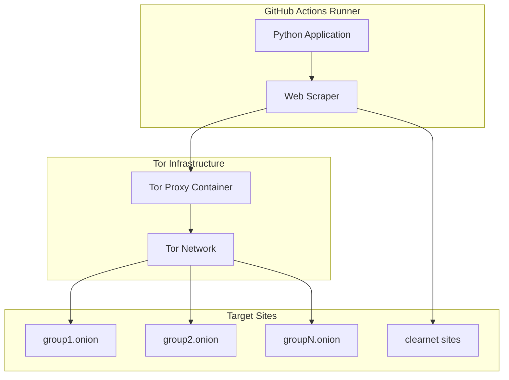
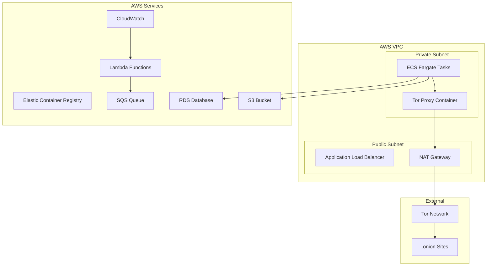

# Tor Integration and AWS Replication Guide

## Why Tor is Essential for Ransomwatch

### The Dark Web Challenge

Ransomware groups primarily operate on the dark web using Tor hidden services (.onion sites) for several reasons:

1. **Anonymity**: Tor provides multi-layered encryption and routing that obscures both the server and client locations
2. **Censorship Resistance**: .onion sites cannot be easily blocked by traditional DNS filtering
3. **Law Enforcement Evasion**: Harder to trace and takedown compared to clearnet sites
4. **Operational Security**: Reduces risk of infrastructure discovery and attribution

### Ransomwatch's Tor Requirements

The project monitors **492+ sites** across **216+ groups**, with approximately **70-80%** being .onion hidden services. Without Tor integration, the system would lose access to the majority of its data sources.

#### Site Distribution Analysis
```
Total Sites: 492
├── .onion sites: ~350-400 (70-80%)
├── Clearnet sites: ~90-140 (20-30%)
└── Hybrid (both): ~50 groups
```

## How Tor is Implemented in Ransomwatch

### Architecture Overview



### Container-Based Tor Proxy

#### Service Configuration (`.github/workflows/ransomwatch.yml`)
```yaml
services:
  torproxy:
    image: ghcr.io/joshhighet/torsocc:latest
    ports:
    - 9050:9050
```

**Key Features:**
- **Isolated Container**: Tor runs in separate container for security
- **SOCKS5 Proxy**: Exposes standard SOCKS5 interface on port 9050
- **Automatic Startup**: Container starts before main application
- **Clean State**: Fresh Tor circuit for each execution

### Python Integration

#### SOCKS Proxy Configuration (`sharedutils.py`)
```python
sockshost = '127.0.0.1'
socksport = 9050

# socks5h:// ensures DNS requests go through Tor
oproxies = {
    'http':  'socks5h://' + str(sockshost) + ':' + str(socksport),
    'https': 'socks5h://' + str(sockshost) + ':' + str(socksport)
}
```

**Critical Implementation Details:**
- **socks5h://**: The 'h' suffix routes DNS through Tor, preventing DNS leaks
- **DNS Leak Prevention**: All hostname resolution happens within Tor network
- **Dual Protocol**: Handles both HTTP and HTTPS through same proxy

#### Request Handling
```python
def socksfetcher(url):
    try:
        request = requests.get(
            url, 
            proxies=oproxies, 
            headers=headers(), 
            timeout=35, 
            verify=False
        )
        return request.text
    except requests.exceptions.ConnectionError as rec:
        if 'SOCKSHTTPConnectionPool' and 'Host unreachable' in str(rec):
            errlog('Host unreachable - check hsdir resolution status')
            return None
```

### Selenium WebDriver Integration (`geckodrive.py`)

For sites requiring JavaScript rendering:

```python
def main(webpage):
    options = Options()
    options.add_argument("-headless")
    
    if '.onion' in webpage:
        # Configure Firefox to use Tor proxy
        options.set_preference('network.proxy.type', 1)
        options.set_preference('network.proxy.socks', sockshost)
        options.set_preference('network.proxy.socks_port', int(socksport))
        options.set_preference("network.proxy.socks_remote_dns", True)
    
    driver = webdriver.Firefox(options=options)
    driver.get(webpage)
    return driver.execute_script("return document.getElementsByTagName('html')[0].innerHTML")
```

**Advanced Features:**
- **Conditional Proxy**: Only uses Tor for .onion sites
- **Remote DNS**: Ensures DNS queries go through Tor
- **Headless Operation**: No GUI required for automation
- **Custom Timeouts**: Handles slow Tor connections

### Security Measures

#### Connection Validation
```python
def checktcp(host, port):
    sock = socket.socket(socket.AF_INET, socket.SOCK_STREAM)
    result = sock.connect_ex((str(host), int(port)))
    sock.close()
    return result == 0

# Validate Tor proxy before use
if not checktcp(sockshost, socksport):
    honk("socks proxy unavailable and required to fetch onionsites!")
```

#### User Agent Rotation
```python
def randomagent():
    with open('assets/useragents.txt', encoding='utf-8') as uafile:
        uas = uafile.read().splitlines()
        return random.choice(uas)
```

#### Certificate Handling
```python
# Accept self-signed certificates common on .onion sites
request = requests.get(url, verify=False, ...)
```

## AWS Infrastructure Replication

### Architecture Design for AWS



### Implementation Strategy

#### 1. Container Infrastructure

##### ECS Fargate Task Definition
```json
{
  "family": "ransomwatch-task",
  "networkMode": "awsvpc",
  "requiresCompatibilities": ["FARGATE"],
  "cpu": "1024",
  "memory": "2048",
  "containerDefinitions": [
    {
      "name": "tor-proxy",
      "image": "your-account.dkr.ecr.region.amazonaws.com/tor-proxy:latest",
      "portMappings": [
        {
          "containerPort": 9050,
          "protocol": "tcp"
        }
      ],
      "essential": true
    },
    {
      "name": "ransomwatch-scraper",
      "image": "your-account.dkr.ecr.region.amazonaws.com/ransomwatch:latest",
      "dependsOn": [
        {
          "containerName": "tor-proxy",
          "condition": "START"
        }
      ],
      "environment": [
        {
          "name": "TOR_PROXY_HOST",
          "value": "localhost"
        },
        {
          "name": "TOR_PROXY_PORT",
          "value": "9050"
        }
      ],
      "essential": true
    }
  ]
}
```

##### Tor Proxy Dockerfile
```dockerfile
FROM alpine:latest

RUN apk add --no-cache tor

# Tor configuration
COPY torrc /etc/tor/torrc

# Create tor user
RUN adduser -D -s /bin/sh tor

# Set permissions
RUN chown -R tor:tor /var/lib/tor
RUN chmod 700 /var/lib/tor

USER tor

EXPOSE 9050

CMD ["tor", "-f", "/etc/tor/torrc"]
```

##### Tor Configuration (`torrc`)
```
# Basic Tor configuration for proxy use
SocksPort 0.0.0.0:9050
DataDirectory /var/lib/tor
Log notice stdout

# Security settings
CookieAuthentication 0
ControlPort 0

# Performance tuning
CircuitBuildTimeout 30
LearnCircuitBuildTimeout 0
MaxCircuitDirtiness 600

# Exit policy (no exit traffic)
ExitPolicy reject *:*
```

#### 2. Networking Configuration

##### VPC Setup with Terraform
```hcl
resource "aws_vpc" "ransomwatch_vpc" {
  cidr_block           = "10.0.0.0/16"
  enable_dns_hostnames = true
  enable_dns_support   = true

  tags = {
    Name = "ransomwatch-vpc"
  }
}

resource "aws_subnet" "private_subnet" {
  vpc_id            = aws_vpc.ransomwatch_vpc.id
  cidr_block        = "10.0.1.0/24"
  availability_zone = "us-west-2a"

  tags = {
    Name = "ransomwatch-private"
  }
}

resource "aws_subnet" "public_subnet" {
  vpc_id                  = aws_vpc.ransomwatch_vpc.id
  cidr_block              = "10.0.2.0/24"
  availability_zone       = "us-west-2a"
  map_public_ip_on_launch = true

  tags = {
    Name = "ransomwatch-public"
  }
}

resource "aws_nat_gateway" "nat_gw" {
  allocation_id = aws_eip.nat_eip.id
  subnet_id     = aws_subnet.public_subnet.id

  tags = {
    Name = "ransomwatch-nat"
  }
}

resource "aws_route_table" "private_rt" {
  vpc_id = aws_vpc.ransomwatch_vpc.id

  route {
    cidr_block     = "0.0.0.0/0"
    nat_gateway_id = aws_nat_gateway.nat_gw.id
  }

  tags = {
    Name = "ransomwatch-private-rt"
  }
}
```

#### 3. Orchestration with EventBridge

##### Scheduled Execution
```hcl
resource "aws_cloudwatch_event_rule" "ransomwatch_schedule" {
  name                = "ransomwatch-schedule"
  description         = "Trigger ransomwatch every 2 hours"
  schedule_expression = "rate(2 hours)"
}

resource "aws_cloudwatch_event_target" "ecs_target" {
  rule      = aws_cloudwatch_event_rule.ransomwatch_schedule.name
  target_id = "RansomwatchECSTarget"
  arn       = aws_ecs_cluster.ransomwatch_cluster.arn
  role_arn  = aws_iam_role.events_task_role.arn

  ecs_target {
    task_count          = 1
    task_definition_arn = aws_ecs_task_definition.ransomwatch_task.arn
    launch_type         = "FARGATE"
    
    network_configuration {
      subnets         = [aws_subnet.private_subnet.id]
      security_groups = [aws_security_group.ecs_tasks.id]
    }
  }
}
```

#### 4. Data Storage Migration

##### RDS Database Schema
```sql
-- Groups table
CREATE TABLE groups (
    id SERIAL PRIMARY KEY,
    name VARCHAR(255) UNIQUE NOT NULL,
    captcha BOOLEAN DEFAULT FALSE,
    parser BOOLEAN DEFAULT FALSE,
    javascript_render BOOLEAN DEFAULT FALSE,
    meta TEXT,
    profile JSONB,
    created_at TIMESTAMP DEFAULT CURRENT_TIMESTAMP,
    updated_at TIMESTAMP DEFAULT CURRENT_TIMESTAMP
);

-- Locations table
CREATE TABLE locations (
    id SERIAL PRIMARY KEY,
    group_id INTEGER REFERENCES groups(id),
    fqdn VARCHAR(255) NOT NULL,
    title VARCHAR(255),
    version INTEGER,
    slug TEXT NOT NULL,
    available BOOLEAN DEFAULT FALSE,
    enabled BOOLEAN DEFAULT TRUE,
    last_scrape TIMESTAMP,
    created_at TIMESTAMP DEFAULT CURRENT_TIMESTAMP,
    updated_at TIMESTAMP DEFAULT CURRENT_TIMESTAMP
);

-- Posts table
CREATE TABLE posts (
    id SERIAL PRIMARY KEY,
    post_title VARCHAR(255) NOT NULL,
    group_name VARCHAR(255) NOT NULL,
    discovered TIMESTAMP DEFAULT CURRENT_TIMESTAMP,
    UNIQUE(post_title, group_name)
);

-- HTML sources table
CREATE TABLE html_sources (
    id SERIAL PRIMARY KEY,
    location_id INTEGER REFERENCES locations(id),
    content TEXT,
    scraped_at TIMESTAMP DEFAULT CURRENT_TIMESTAMP,
    content_hash VARCHAR(64)
);
```

##### S3 Storage Structure
```
ransomwatch-bucket/
├── html-sources/
│   ├── 2025/06/17/
│   │   ├── lockbit3-{hash}.html
│   │   └── blackbasta-{hash}.html
├── generated-docs/
│   ├── index.html
│   ├── stats.html
│   └── api/
│       ├── groups.json
│       └── posts.json
└── graphs/
    ├── posts-by-day.png
    └── group-activity.png
```

#### 5. Application Code Modifications

##### Database Integration
```python
import psycopg2
from psycopg2.extras import RealDictCursor
import boto3

class AWSRansomwatchDB:
    def __init__(self):
        self.conn = psycopg2.connect(
            host=os.environ['RDS_ENDPOINT'],
            database=os.environ['RDS_DATABASE'],
            user=os.environ['RDS_USERNAME'],
            password=os.environ['RDS_PASSWORD']
        )
        self.s3 = boto3.client('s3')
        self.bucket = os.environ['S3_BUCKET']
    
    def save_html_source(self, group_name, fqdn, content):
        # Save to S3
        key = f"html-sources/{datetime.now().strftime('%Y/%m/%d')}/{group_name}-{fqdn}.html"
        self.s3.put_object(
            Bucket=self.bucket,
            Key=key,
            Body=content,
            ContentType='text/html'
        )
        
        # Save metadata to RDS
        with self.conn.cursor() as cur:
            cur.execute("""
                INSERT INTO html_sources (location_id, content_hash, scraped_at)
                SELECT l.id, %s, %s
                FROM locations l
                JOIN groups g ON l.group_id = g.id
                WHERE g.name = %s AND l.fqdn = %s
            """, (hashlib.sha256(content.encode()).hexdigest(), datetime.now(), group_name, fqdn))
        self.conn.commit()
    
    def add_post(self, post_title, group_name):
        with self.conn.cursor() as cur:
            cur.execute("""
                INSERT INTO posts (post_title, group_name, discovered)
                VALUES (%s, %s, %s)
                ON CONFLICT (post_title, group_name) DO NOTHING
                RETURNING id
            """, (post_title, group_name, datetime.now()))
            
            if cur.fetchone():
                # New post - send notifications
                self.send_notifications(post_title, group_name)
        self.conn.commit()
```

##### CloudWatch Integration
```python
import boto3

class CloudWatchLogger:
    def __init__(self):
        self.cloudwatch = boto3.client('cloudwatch')
        self.logs = boto3.client('logs')
    
    def log_scrape_metrics(self, group_name, success, response_time):
        self.cloudwatch.put_metric_data(
            Namespace='Ransomwatch',
            MetricData=[
                {
                    'MetricName': 'ScrapeSuccess',
                    'Dimensions': [
                        {
                            'Name': 'GroupName',
                            'Value': group_name
                        }
                    ],
                    'Value': 1 if success else 0,
                    'Unit': 'Count'
                },
                {
                    'MetricName': 'ResponseTime',
                    'Dimensions': [
                        {
                            'Name': 'GroupName',
                            'Value': group_name
                        }
                    ],
                    'Value': response_time,
                    'Unit': 'Seconds'
                }
            ]
        )
```

### Security Considerations for AWS

#### 1. Network Security
```hcl
resource "aws_security_group" "ecs_tasks" {
  name_prefix = "ransomwatch-ecs-tasks"
  vpc_id      = aws_vpc.ransomwatch_vpc.id

  # Allow outbound traffic through NAT Gateway
  egress {
    protocol    = "-1"
    from_port   = 0
    to_port     = 0
    cidr_blocks = ["0.0.0.0/0"]
  }

  # No inbound traffic allowed
  tags = {
    Name = "ransomwatch-ecs-tasks"
  }
}
```

#### 2. IAM Roles and Policies
```hcl
resource "aws_iam_role" "ecs_task_role" {
  name = "ransomwatch-ecs-task-role"

  assume_role_policy = jsonencode({
    Version = "2012-10-17"
    Statement = [
      {
        Action = "sts:AssumeRole"
        Effect = "Allow"
        Principal = {
          Service = "ecs-tasks.amazonaws.com"
        }
      }
    ]
  })
}

resource "aws_iam_policy" "ransomwatch_policy" {
  name = "ransomwatch-policy"

  policy = jsonencode({
    Version = "2012-10-17"
    Statement = [
      {
        Effect = "Allow"
        Action = [
          "s3:GetObject",
          "s3:PutObject",
          "s3:DeleteObject"
        ]
        Resource = "${aws_s3_bucket.ransomwatch_bucket.arn}/*"
      },
      {
        Effect = "Allow"
        Action = [
          "rds:DescribeDBInstances"
        ]
        Resource = "*"
      },
      {
        Effect = "Allow"
        Action = [
          "logs:CreateLogGroup",
          "logs:CreateLogStream",
          "logs:PutLogEvents"
        ]
        Resource = "arn:aws:logs:*:*:*"
      }
    ]
  })
}
```

#### 3. Secrets Management
```hcl
resource "aws_secretsmanager_secret" "db_credentials" {
  name = "ransomwatch/db-credentials"
}

resource "aws_secretsmanager_secret_version" "db_credentials" {
  secret_id = aws_secretsmanager_secret.db_credentials.id
  secret_string = jsonencode({
    username = "ransomwatch"
    password = random_password.db_password.result
  })
}
```

### Cost Optimization for AWS

#### Estimated Monthly Costs
| Service | Configuration | Monthly Cost |
|---------|---------------|--------------|
| ECS Fargate | 0.25 vCPU, 0.5GB RAM, 12 runs/day | $15-25 |
| RDS PostgreSQL | db.t3.micro | $15-20 |
| S3 Storage | 10GB + requests | $5-10 |
| NAT Gateway | Data transfer | $45-60 |
| CloudWatch | Logs + metrics | $5-15 |
| **Total** | | **$85-130/month** |

#### Cost Optimization Strategies
1. **Spot Instances**: Use Fargate Spot for 70% cost reduction
2. **Scheduled Scaling**: Scale down RDS during low activity
3. **S3 Lifecycle**: Move old HTML to cheaper storage classes
4. **VPC Endpoints**: Reduce NAT Gateway costs for AWS services

### Monitoring and Alerting

#### CloudWatch Dashboards
```python
dashboard_body = {
    "widgets": [
        {
            "type": "metric",
            "properties": {
                "metrics": [
                    ["Ransomwatch", "ScrapeSuccess", "GroupName", "lockbit3"],
                    [".", "ResponseTime", ".", "."]
                ],
                "period": 300,
                "stat": "Average",
                "region": "us-west-2",
                "title": "Scraping Metrics"
            }
        }
    ]
}
```

#### SNS Notifications
```hcl
resource "aws_sns_topic" "ransomwatch_alerts" {
  name = "ransomwatch-alerts"
}

resource "aws_cloudwatch_metric_alarm" "high_failure_rate" {
  alarm_name          = "ransomwatch-high-failure-rate"
  comparison_operator = "GreaterThanThreshold"
  evaluation_periods  = "2"
  metric_name         = "ScrapeFailures"
  namespace           = "Ransomwatch"
  period              = "300"
  statistic           = "Sum"
  threshold           = "10"
  alarm_description   = "This metric monitors scraping failure rate"
  alarm_actions       = [aws_sns_topic.ransomwatch_alerts.arn]
}
```

## Migration Strategy

### Phase 1: Infrastructure Setup (Week 1-2)
1. Deploy VPC and networking components
2. Set up ECS cluster and task definitions
3. Configure RDS database
4. Create S3 buckets and IAM roles

### Phase 2: Application Migration (Week 3-4)
1. Modify application code for AWS services
2. Implement database schema and data migration
3. Test Tor connectivity in AWS environment
4. Set up monitoring and alerting

### Phase 3: Deployment and Testing (Week 5-6)
1. Deploy application to ECS
2. Perform end-to-end testing
3. Set up CI/CD pipeline
4. Configure backup and disaster recovery

### Phase 4: Optimization (Week 7-8)
1. Performance tuning and cost optimization
2. Security hardening
3. Documentation and runbooks
4. Go-live preparation

This AWS implementation provides enterprise-grade scalability, security, and reliability while maintaining the core Tor integration that makes ransomwatch effective at monitoring dark web ransomware activities.